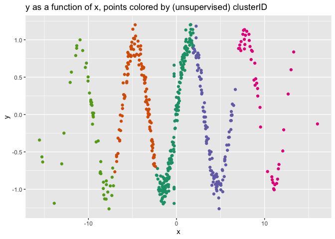
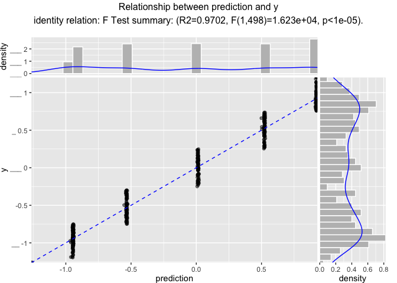
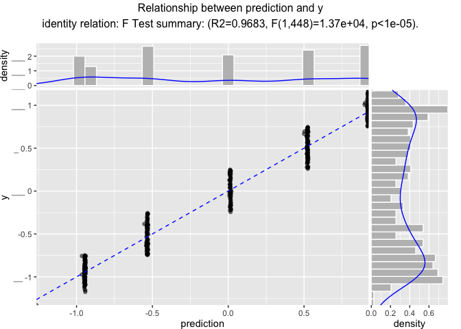

vtreat for Unsupervised problems
================

Using vtreat with Unsupervised Problems and Non-Y-aware data treatment
======================================================================

Nina Zumel and John Mount updated February 2020

Note this is a description of the [`R` version of `vtreat`](https://github.com/WinVector/vtreat), the same example for the [`Python` version of `vtreat`](https://github.com/WinVector/pyvtreat) can be found [here](https://github.com/WinVector/pyvtreat/blob/master/Examples/Unsupervised/Unsupervised.md).

Preliminaries
-------------

Load modules/packages.

``` r
library(vtreat)
```

    ## Loading required package: wrapr

``` r
packageVersion('vtreat')
```

    ## [1] '1.6.0'

``` r
suppressPackageStartupMessages(library(ggplot2))
library(WVPlots)
library(rqdatatable)
```

    ## Loading required package: rquery

    ## 
    ## Attaching package: 'rquery'

    ## The following object is masked from 'package:ggplot2':
    ## 
    ##     arrow

Generate example data.

-   `y` is a noisy sinusoidal plus linear function of the variable `x`
-   Input `xc` is a categorical variable that represents a discretization of `y`, along with some `NaN`s
-   Input `x2` is a pure noise variable with no relationship to the output
-   Input `x3` is a constant variable

``` r
set.seed(2020)

make_data <- function(nrows) {
    d <- data.frame(x = 5*rnorm(nrows))
    d['y'] = sin(d[['x']]) + 0.01*d[['x']] + 0.1*rnorm(n = nrows)
    d[4:10, 'x'] = NA                  # introduce NAs
    d['xc'] = paste0('level_', 5*round(d$y/5, 1))
    d['x2'] = rnorm(n = nrows)
    d['x3'] = 1
    d[d['xc']=='level_-1', 'xc'] = NA  # introduce a NA level
    return(d)
}

d = make_data(500)

d %.>%
  head(.) %.>%
  knitr::kable(.)
```

|          x|           y| xc          |          x2|   x3|
|----------:|-----------:|:------------|-----------:|----:|
|   1.884861|   1.0906132| level\_1    |   0.0046504|    1|
|   1.507742|   1.0108804| level\_1    |  -1.2287497|    1|
|  -5.490116|   0.7766693| level\_1    |  -0.1405980|    1|
|         NA|   0.5442452| level\_0.5  |  -0.2073270|    1|
|         NA|  -0.9738103| NA          |  -0.9215306|    1|
|         NA|  -0.4968719| level\_-0.5 |   0.3604742|    1|

### Some quick data exploration

Check how many levels `xc` has, and their distribution (including `NaN`)

``` r
unique(d['xc'])
```

    ##            xc
    ## 1     level_1
    ## 4   level_0.5
    ## 5        <NA>
    ## 6  level_-0.5
    ## 13    level_0
    ## 91 level_-1.5

``` r
table(d$xc, useNA = 'always')
```

    ## 
    ## level_-0.5 level_-1.5    level_0  level_0.5    level_1       <NA> 
    ##         91          2         92         91        106        118

Build a transform appropriate for unsupervised (or non-y-aware) problems.
-------------------------------------------------------------------------

The `vtreat` package is primarily intended for data treatment prior to supervised learning, as detailed in the [Classification](https://github.com/WinVector/vtreat/blob/master/Examples/Classification/Classification.md) and [Regression](https://github.com/WinVector/vtreat/blob/master/Examples/Regression/Regression.md) examples. In these situations, `vtreat` specifically uses the relationship between the inputs and the outcomes in the training data to create certain types of synthetic variables. We call these more complex synthetic variables *y-aware variables*.

However, you may also want to use `vtreat` for basic data treatment for unsupervised problems, when there is no outcome variable. Or, you may not want to create any y-aware variables when preparing the data for supervised modeling. For these applications, `vtreat` is a convenient alternative to `model.matrix()` that keeps information about the levels of factor variables observed in the data, and can manage novel levels that appear in future data.

In any case, we still want training data where all the input variables are numeric and have no missing values or `NaN`s.

First create the data treatment transform object, in this case a treatment for an unsupervised problem.

``` r
transform = vtreat::designTreatmentsZ(
    dframe = d,                              # data to learn transform from
    varlist = setdiff(colnames(d), c('y'))   # columns to transform
)
```

    ## [1] "vtreat 1.6.0 inspecting inputs Thu Feb 27 15:24:10 2020"
    ## [1] "designing treatments Thu Feb 27 15:24:10 2020"
    ## [1] " have initial level statistics Thu Feb 27 15:24:10 2020"
    ## [1] " scoring treatments Thu Feb 27 15:24:11 2020"
    ## [1] "have treatment plan Thu Feb 27 15:24:11 2020"

``` r
score_frame = transform$scoreFrame
```

Use the training data `d` to fit the transform and the return a treated training set: completely numeric, with no missing values.

``` r
d_prepared = prepare(transform, d)
d_prepared$y = d$y
```

Now examine the score frame, which gives information about each new variable, including its type and which original variable it is derived from. Some of the columns of the score frame (`rsq`, `sig`) are not relevant to the unsupervised case; those columns are used by the Regression and Classification transforms.

``` r
knitr::kable(score_frame)
```

| varName                        | varMoves |  rsq|  sig| needsSplit |  extraModelDegrees| origName | code  |
|:-------------------------------|:---------|----:|----:|:-----------|------------------:|:---------|:------|
| x                              | TRUE     |    0|    1| FALSE      |                  0| x        | clean |
| x\_isBAD                       | TRUE     |    0|    1| FALSE      |                  0| x        | isBAD |
| xc\_catP                       | TRUE     |    0|    1| TRUE       |                  5| xc       | catP  |
| x2                             | TRUE     |    0|    1| FALSE      |                  0| x2       | clean |
| xc\_lev\_NA                    | TRUE     |    0|    1| FALSE      |                  0| xc       | lev   |
| xc\_lev\_x\_level\_minus\_0\_5 | TRUE     |    0|    1| FALSE      |                  0| xc       | lev   |
| xc\_lev\_x\_level\_minus\_1\_5 | TRUE     |    0|    1| FALSE      |                  0| xc       | lev   |
| xc\_lev\_x\_level\_0           | TRUE     |    0|    1| FALSE      |                  0| xc       | lev   |
| xc\_lev\_x\_level\_0\_5        | TRUE     |    0|    1| FALSE      |                  0| xc       | lev   |
| xc\_lev\_x\_level\_1           | TRUE     |    0|    1| FALSE      |                  0| xc       | lev   |

Notice that the variable `xc` has been converted to multiple variables:

-   an indicator variable for each possible level, including `NA` or missing (`xc_lev*`)
-   a variable that returns how prevalent this particular value of `xc` is in the training data (`xc_catP`)

The numeric variable `x` has been converted to two variables:

-   a clean version of `x` that has no `NaN`s or missing values
-   a variable indicating when `x` was `NaN` or `NA` in the original data (`xd_isBAD`)

Any or all of these new variables are available for downstream modeling.

Also note that the variable `x3` does not appear in the score frame (or in the treated data), as it had no range (didn't vary), so the unsupervised treatment dropped it.

Let's look at the top of `d_prepared`, which includes all the new variables, plus `y` (and excluding `x3`).

``` r
d_prepared %.>%
  head(.) %.>%
  knitr::kable(.)
```

|           x|  x\_isBAD|  xc\_catP|          x2|  xc\_lev\_NA|  xc\_lev\_x\_level\_minus\_0\_5|  xc\_lev\_x\_level\_minus\_1\_5|  xc\_lev\_x\_level\_0|  xc\_lev\_x\_level\_0\_5|  xc\_lev\_x\_level\_1|           y|
|-----------:|---------:|---------:|-----------:|------------:|-------------------------------:|-------------------------------:|---------------------:|------------------------:|---------------------:|-----------:|
|   1.8848606|         0|     0.212|   0.0046504|            0|                               0|                               0|                     0|                        0|                     1|   1.0906132|
|   1.5077419|         0|     0.212|  -1.2287497|            0|                               0|                               0|                     0|                        0|                     1|   1.0108804|
|  -5.4901159|         0|     0.212|  -0.1405980|            0|                               0|                               0|                     0|                        0|                     1|   0.7766693|
|  -0.2704873|         1|     0.182|  -0.2073270|            0|                               0|                               0|                     0|                        1|                     0|   0.5442452|
|  -0.2704873|         1|     0.236|  -0.9215306|            1|                               0|                               0|                     0|                        0|                     0|  -0.9738103|
|  -0.2704873|         1|     0.182|   0.3604742|            0|                               1|                               0|                     0|                        0|                     0|  -0.4968719|

Using the Prepared Data to Model
--------------------------------

Of course, what we really want to do with the prepared training data is to model.

### K-means clustering

Let's start with an unsupervised analysis: clustering.

``` r
# don't use y to cluster
not_variables <- c('y')
model_vars <- setdiff(colnames(d_prepared), not_variables)

clusters = kmeans(d_prepared[, model_vars, drop = FALSE], centers = 5)

d_prepared['clusterID'] <- clusters$cluster
head(d_prepared$clusterID)
```

    ## [1] 1 1 2 1 1 1

``` r
ggplot(data = d_prepared, aes(x=x, y=y, color=as.character(clusterID))) +
  geom_point() +
  ggtitle('y as a function of x, points colored by (unsupervised) clusterID') +
  theme(legend.position="none") +
  scale_colour_brewer(palette = "Dark2")
```



### Supervised modeling with non-y-aware variables

Since in this case we have an outcome variable, `y`, we can try fitting a linear regression model to `d_prepared`.

``` r
f <- wrapr::mk_formula('y', model_vars)

model = lm(f, data = d_prepared)

# now predict
d_prepared['prediction'] = predict(
  model,
  newdata = d_prepared)
```

    ## Warning in predict.lm(model, newdata = d_prepared): prediction from a rank-
    ## deficient fit may be misleading

``` r
# look at the fit (on the training data)
WVPlots::ScatterHist(
  d_prepared, 
  xvar = 'prediction',
  yvar = 'y',
  smoothmethod = 'identity',
  estimate_sig = TRUE,
  title = 'Relationship between prediction and y')
```



Now apply the model to new data.

``` r
# create the new data
dtest <- make_data(450)

# prepare the new data with vtreat
dtest_prepared = prepare(transform, dtest)
# dtest %.>% transform is an alias for prepare(transform, dtest)
dtest_prepared$y = dtest$y

# apply the model to the prepared data
dtest_prepared['prediction'] = predict(
  model,
  newdata = dtest_prepared)
```

    ## Warning in predict.lm(model, newdata = dtest_prepared): prediction from a rank-
    ## deficient fit may be misleading

``` r
# compare the predictions to the outcome (on the test data)
WVPlots::ScatterHist(
  dtest_prepared, 
  xvar = 'prediction',
  yvar = 'y',
  smoothmethod = 'identity',
  estimate_sig = TRUE,
  title = 'Relationship between prediction and y')
```



``` r
# get r-squared
sigr::wrapFTest(dtest_prepared, 
                predictionColumnName = 'prediction',
                yColumnName = 'y',
                nParameters = length(model_vars) + 1)
```

    ## [1] "F Test summary: (R2=0.9683, F(11,438)=1218, p<1e-05)."

Parameters for `UnsupervisedTreatment`
--------------------------------------

We've tried to set the defaults for all parameters so that `vtreat` is usable out of the box for most applications.

``` r
suppressPackageStartupMessages(library(printr))
args("designTreatmentsZ")
```

    ## function (dframe, varlist, ..., minFraction = 0, weights = c(), 
    ##     rareCount = 0, collarProb = 0, codeRestriction = NULL, customCoders = NULL, 
    ##     verbose = TRUE, parallelCluster = NULL, use_parallel = TRUE, 
    ##     missingness_imputation = NULL, imputation_map = NULL) 
    ## NULL

Some parameters of note include:

**codeRestriction**: The types of synthetic variables that `vtreat` will (potentially) produce. By default, all possible applicable types will be produced. See *Types of prepared variables* below.

**minFraction** (default: 0): For categorical variables, indicator variables (type `levs`) are only produced for levels that are present at least `minFraction` of the time. A consequence of this is that 1/`minFraction` is the maximum number of indicators that will be produced for a given categorical variable. By default, all possible indicator variables are produced.

**missingness\_imputation**: The function or value that `vtreat` uses to impute or "fill in" missing numerical values. The default is `mean`. To change the imputation function or use different functions/values for different columns, see the [Imputation example](https://github.com/WinVector/vtreat/blob/master/Examples/Imputation/Imputation.md) for examples.

**customCoders**: For passing in user-defined transforms for custom data preparation. Won't be needed in most situations, but see [here](http://www.win-vector.com/blog/2017/09/custom-level-coding-in-vtreat/) for an example of applying a GAM transform to input variables.

### Example: Restrict the number of indicator variables

``` r
# calculate the prevalence of each level of xc by hand, including NA
table(d$xc, useNA = "ifany")/nrow(d)
```

|  level\_-0.5|  level\_-1.5|  level\_0|  level\_0.5|  level\_1|     NA|
|------------:|------------:|---------:|-----------:|---------:|------:|
|        0.182|        0.004|     0.184|       0.182|     0.212|  0.236|

``` r
transform_common = designTreatmentsZ(
    dframe = d,                              # data to learn transform from
    varlist = setdiff(colnames(d), c('y')),  # columns to transform
    minFraction = 0.2                        # only make indicators for levels that appear more than 20% of the time
)
```

    ## [1] "vtreat 1.6.0 inspecting inputs Thu Feb 27 15:24:13 2020"
    ## [1] "designing treatments Thu Feb 27 15:24:13 2020"
    ## [1] " have initial level statistics Thu Feb 27 15:24:13 2020"
    ## [1] " scoring treatments Thu Feb 27 15:24:13 2020"
    ## [1] "have treatment plan Thu Feb 27 15:24:13 2020"

``` r
d_prepared = prepare(transform_common, d)   # fit the transform
knitr::kable(transform_common$scoreFrame)   # examine the score frame
```

| varName              | varMoves |  rsq|  sig| needsSplit |  extraModelDegrees| origName | code  |
|:---------------------|:---------|----:|----:|:-----------|------------------:|:---------|:------|
| x                    | TRUE     |    0|    1| FALSE      |                  0| x        | clean |
| x\_isBAD             | TRUE     |    0|    1| FALSE      |                  0| x        | isBAD |
| xc\_catP             | TRUE     |    0|    1| TRUE       |                  5| xc       | catP  |
| x2                   | TRUE     |    0|    1| FALSE      |                  0| x2       | clean |
| xc\_lev\_NA          | TRUE     |    0|    1| FALSE      |                  0| xc       | lev   |
| xc\_lev\_x\_level\_1 | TRUE     |    0|    1| FALSE      |                  0| xc       | lev   |

In this case, the unsupervised treatment only created levels for the two most common levels, `level_1` and `NA`, which are both present more than 20% of the time.

In unsupervised situations, this may only be desirable when there are an unworkably large number of possible levels (for example, when using ZIP code as a variable). It is more useful in conjunction with the y-aware variables produced by `designTreatmentsN`/`mkCrossFrameNExperiment` (regression), `designTreatmentsC`/`mkCrossFrameCExperiment` (binary classification), or `designTreatmentsM`/`mkCrossFrameMExperiment` (multiclass classification).

Types of prepared variables
---------------------------

**clean**: Produced from numerical variables: a clean numerical variable with no `NaNs` or missing values

**lev**: Produced from categorical variables, one for each level: for each level of the variable, indicates if that level was "on"

**catP**: Produced from categorical variables: indicates how often each level of the variable was "on" (its prevalence)

**isBAD**: Produced for numerical variables: an indicator variable that marks when the original variable was missing or `NaN`

### Example: Produce only a subset of variable types

In this example, suppose you only want to use indicators and continuous variables in your model; in other words, you only want to use variables of types (`clean`, `isBAD`, and `lev`), and no `catP` variables.

``` r
transform_thin = vtreat::designTreatmentsZ(
    dframe = d,                              # data to learn transform from
    varlist = setdiff(colnames(d), c('y')),  # columns to transform
    codeRestriction = c('clean', 'lev', 'isBAD'))
```

    ## [1] "vtreat 1.6.0 inspecting inputs Thu Feb 27 15:24:13 2020"
    ## [1] "designing treatments Thu Feb 27 15:24:13 2020"
    ## [1] " have initial level statistics Thu Feb 27 15:24:13 2020"
    ## [1] " scoring treatments Thu Feb 27 15:24:13 2020"
    ## [1] "have treatment plan Thu Feb 27 15:24:13 2020"

``` r
score_frame_thin = transform_thin$scoreFrame
knitr::kable(score_frame_thin)
```

| varName                        | varMoves |  rsq|  sig| needsSplit |  extraModelDegrees| origName | code  |
|:-------------------------------|:---------|----:|----:|:-----------|------------------:|:---------|:------|
| x                              | TRUE     |    0|    1| FALSE      |                  0| x        | clean |
| x\_isBAD                       | TRUE     |    0|    1| FALSE      |                  0| x        | isBAD |
| x2                             | TRUE     |    0|    1| FALSE      |                  0| x2       | clean |
| xc\_lev\_NA                    | TRUE     |    0|    1| FALSE      |                  0| xc       | lev   |
| xc\_lev\_x\_level\_minus\_0\_5 | TRUE     |    0|    1| FALSE      |                  0| xc       | lev   |
| xc\_lev\_x\_level\_minus\_1\_5 | TRUE     |    0|    1| FALSE      |                  0| xc       | lev   |
| xc\_lev\_x\_level\_0           | TRUE     |    0|    1| FALSE      |                  0| xc       | lev   |
| xc\_lev\_x\_level\_0\_5        | TRUE     |    0|    1| FALSE      |                  0| xc       | lev   |
| xc\_lev\_x\_level\_1           | TRUE     |    0|    1| FALSE      |                  0| xc       | lev   |

Conclusion
----------

In all cases (classification, regression, unsupervised, and multinomial classification) the intent is that `vtreat` transforms are essentially one liners.

The preparation commands are organized as follows:

-   **Regression**: [`R` regression example](https://github.com/WinVector/vtreat/blob/master/Examples/Regression/Regression.md), [`Python` regression example](https://github.com/WinVector/pyvtreat/blob/master/Examples/Regression/Regression.md).
-   **Classification**: [`R` classification example](https://github.com/WinVector/vtreat/blob/master/Examples/Classification/Classification.md), [`Python` classification example](https://github.com/WinVector/pyvtreat/blob/master/Examples/Classification/Classification.md).
-   **Unsupervised tasks**: [`R` unsupervised example](https://github.com/WinVector/vtreat/blob/master/Examples/Unsupervised/Unsupervised.md), [`Python` unsupervised example](https://github.com/WinVector/pyvtreat/blob/master/Examples/Unsupervised/Unsupervised.md).
-   **Multinomial classification**: [`R` multinomial classification example](https://github.com/WinVector/vtreat/blob/master/Examples/Multinomial/MultinomialExample.md), [`Python` multinomial classification example](https://github.com/WinVector/pyvtreat/blob/master/Examples/Multinomial/MultinomialExample.md).

These current revisions of the examples are designed to be small, yet complete. So as a set they have some overlap, but the user can rely mostly on a single example for a single task type.
