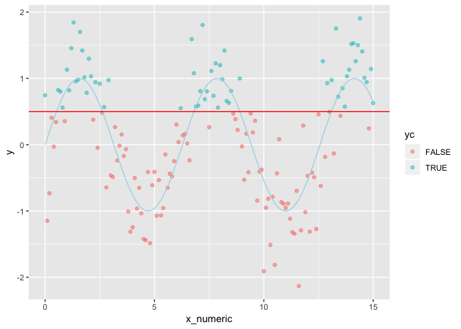
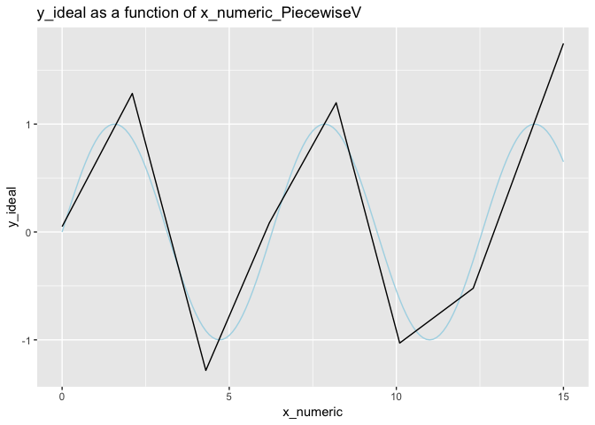
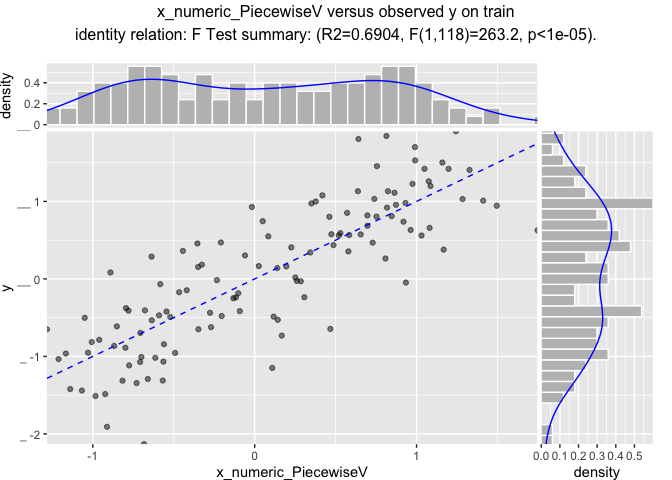
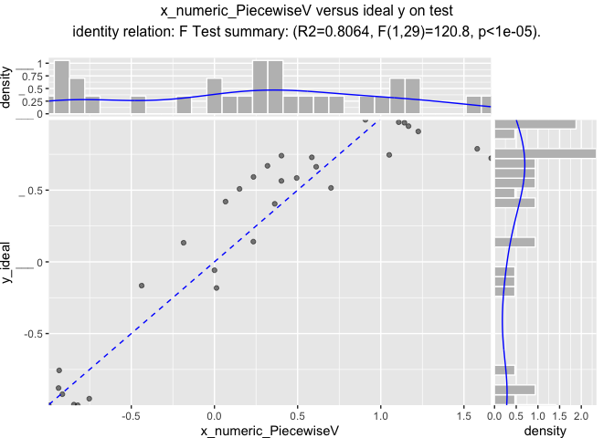

CustomCoders2
================

``` r
library("ggplot2")
```

``` r
customCoders = list('c.PiecewiseV.num' = vtreat::solve_piecewise,
                    'n.PiecewiseV.num' = vtreat::solve_piecewise,
                    'c.knearest.num' = vtreat::square_window,
                    'n.knearest.num' = vtreat::square_window)
codeRestriction = c("PiecewiseV", 
                    "knearest",
                    "clean", "isBAD", "catB", "catP")
```

``` r
d <- data.frame(x_numeric = seq(0, 15, by = 0.1))
d$x_cat <- paste0("l_", round(d$x_numeric, digits = 1))
d$y_ideal <- sin(d$x_numeric)
d$x_numeric_noise <- d$x_numeric[sample.int(nrow(d), nrow(d), replace = FALSE)]
d$x_cat_noise <- d$x_cat[sample.int(nrow(d), nrow(d), replace = FALSE)]
d$y <- d$y_ideal + 0.5*rnorm(nrow(d))
d$yc <- d$y>0.5
d$is_train <- runif(nrow(d))>=0.2

head(d)
```

    ##   x_numeric x_cat    y_ideal x_numeric_noise x_cat_noise           y    yc
    ## 1       0.0   l_0 0.00000000             1.9      l_12.5  0.74512196  TRUE
    ## 2       0.1 l_0.1 0.09983342             9.2       l_8.8 -1.14814461 FALSE
    ## 3       0.2 l_0.2 0.19866933             9.3       l_4.8 -0.73178953 FALSE
    ## 4       0.3 l_0.3 0.29552021             0.4      l_12.1  0.40747177 FALSE
    ## 5       0.4 l_0.4 0.38941834            14.1       l_7.7 -0.03030095 FALSE
    ## 6       0.5 l_0.5 0.47942554             5.5         l_5  0.34149408 FALSE
    ##   is_train
    ## 1     TRUE
    ## 2     TRUE
    ## 3     TRUE
    ## 4     TRUE
    ## 5     TRUE
    ## 6     TRUE

``` r
summary(d)
```

    ##    x_numeric        x_cat              y_ideal        x_numeric_noise
    ##  Min.   : 0.00   Length:151         Min.   :-1.0000   Min.   : 0.00  
    ##  1st Qu.: 3.75   Class :character   1st Qu.:-0.5813   1st Qu.: 3.75  
    ##  Median : 7.50   Mode  :character   Median : 0.2315   Median : 7.50  
    ##  Mean   : 7.50                      Mean   : 0.1186   Mean   : 7.50  
    ##  3rd Qu.:11.25                      3rd Qu.: 0.8011   3rd Qu.:11.25  
    ##  Max.   :15.00                      Max.   : 0.9996   Max.   :15.00  
    ##  x_cat_noise              y               yc           is_train      
    ##  Length:151         Min.   :-2.1323   Mode :logical   Mode :logical  
    ##  Class :character   1st Qu.:-0.5730   FALSE:92        FALSE:31       
    ##  Mode  :character   Median : 0.2457   TRUE :59        TRUE :120      
    ##                     Mean   : 0.1235                                  
    ##                     3rd Qu.: 0.8382                                  
    ##                     Max.   : 1.9054

``` r
ggplot(data=d) +
  geom_point(aes(x = x_numeric, y = y, color = yc), alpha=0.5) + 
  geom_line(aes(x = x_numeric, y = y_ideal), color = "lightblue") +
  geom_hline(yintercept = 0.5, color = "red")
```



``` r
cfn <- vtreat::mkCrossFrameNExperiment(
  d[d$is_train, , drop=FALSE], 
  c('x_numeric', 'x_numeric_noise', 'x_cat', 'x_cat_noise'), 'y',
  customCoders = customCoders,
  codeRestriction = codeRestriction,
  verbose = FALSE)

cfn$treatments
```

    ##          origName       code          rsq          sig extraModelDegrees
    ## 1       x_numeric PiecewiseV 6.758151e-01 1.216799e-30               120
    ## 2       x_numeric   knearest 4.643300e-01 1.077773e-17               120
    ## 3       x_numeric      clean 1.610979e-05 9.652967e-01                 0
    ## 4 x_numeric_noise PiecewiseV 2.050607e-04 8.766375e-01               120
    ## 5 x_numeric_noise   knearest 1.368122e-02 2.032782e-01               120
    ## 6 x_numeric_noise      clean 7.088572e-03 3.605769e-01                 0

``` r
vtreat::variable_values(cfn$treatments$scoreFrame)
```

    ##                        rsq count          sig             var
    ## x_numeric       0.67581511     3 3.650398e-30       x_numeric
    ## x_numeric_noise 0.01368122     3 6.098345e-01 x_numeric_noise

``` r
# or directly
vtreat::value_variables_N(
  d[d$is_train, , drop=FALSE], 
  c('x_numeric', 'x_numeric_noise', 'x_cat', 'x_cat_noise'), 'y')
```

    ##                        rsq count          sig             var
    ## x_numeric       0.64542821     4 9.835474e-28       x_numeric
    ## x_numeric_noise 0.01363169     4 8.164153e-01 x_numeric_noise

``` r
prepared <- vtreat::prepare(cfn$treatments, d)
d$x_numeric_PiecewiseV <- prepared$x_numeric_PiecewiseV
d$x_numeric_knearest <- prepared$x_numeric_knearest

ggplot(data=d) +
  # geom_point(aes(x = x_numeric, y = y)) + 
  geom_line(aes(x = x_numeric, y = y_ideal), color = "lightblue") + 
  geom_line(aes(x = x_numeric, y = x_numeric_PiecewiseV)) +
  ggtitle("y_ideal as a function of x_numeric_PiecewiseV")
```



``` r
ggplot(data=d) +
  # geom_point(aes(x = x_numeric, y = y)) + 
  geom_line(aes(x = x_numeric, y = y_ideal), color = "lightblue") + 
  geom_line(aes(x = x_numeric, y = x_numeric_knearest)) +
  ggtitle("y_ideal as a function of x_numeric_knearest")
```


``` r
WVPlots::ScatterHist(d[d$is_train, , drop=FALSE], 
                     "x_numeric_PiecewiseV", "y",
                     "x_numeric_PiecewiseV versus observed y on train",
                     smoothmethod = "identity",
                     estimate_sig = TRUE)
```



``` r
WVPlots::ScatterHist(d[d$is_train, , drop=FALSE], 
                     "x_numeric_PiecewiseV", "y_ideal",
                     "x_numeric_PiecewiseV versus ideal y on train",
                     smoothmethod = "identity",
                     estimate_sig = TRUE)
```


``` r
WVPlots::ScatterHist(d[!d$is_train, , drop=FALSE], 
                     "x_numeric_PiecewiseV", "y",
                     "x_numeric_PiecewiseV versus observed y on test",
                     smoothmethod = "identity",
                     estimate_sig = TRUE)
```


``` r
WVPlots::ScatterHist(d[!d$is_train, , drop=FALSE], 
                     "x_numeric_PiecewiseV", "y_ideal",
                     "x_numeric_PiecewiseV versus ideal y on test",
                     smoothmethod = "identity",
                     estimate_sig = TRUE)
```



``` r
cfc <- vtreat::mkCrossFrameCExperiment(
  d[d$is_train, , drop=FALSE], 
  c('x_numeric', 'x_numeric_noise', 'x_cat', 'x_cat_noise'), 'yc', TRUE,
  customCoders = customCoders,
  codeRestriction = codeRestriction,
  verbose = FALSE)

cfc$treatments
```

    ##          origName       code         rsq          sig extraModelDegrees
    ## 1       x_numeric PiecewiseV 0.373710139 1.329297e-14               120
    ## 2       x_numeric   knearest 0.279956649 2.609148e-11               120
    ## 3       x_numeric      clean 0.001081731 6.785594e-01                 0
    ## 4 x_numeric_noise PiecewiseV 0.003701413 4.433128e-01               120
    ## 5 x_numeric_noise   knearest 0.009926324 2.093300e-01               120
    ## 6 x_numeric_noise      clean 0.009267856 2.251083e-01                 0

``` r
vtreat::variable_values(cfc$treatments$scoreFrame)
```

    ##                         rsq count          sig             var
    ## x_numeric       0.373710139     3 3.987890e-14       x_numeric
    ## x_numeric_noise 0.009926324     3 6.279901e-01 x_numeric_noise

``` r
# or directly
vtreat::value_variables_C(
  d[d$is_train, , drop=FALSE], 
  c('x_numeric', 'x_numeric_noise', 'x_cat', 'x_cat_noise'), 'yc', TRUE)
```

    ##                        rsq count          sig             var
    ## x_numeric       0.39918339     4 6.816157e-15       x_numeric
    ## x_numeric_noise 0.01492418     4 4.948781e-01 x_numeric_noise
