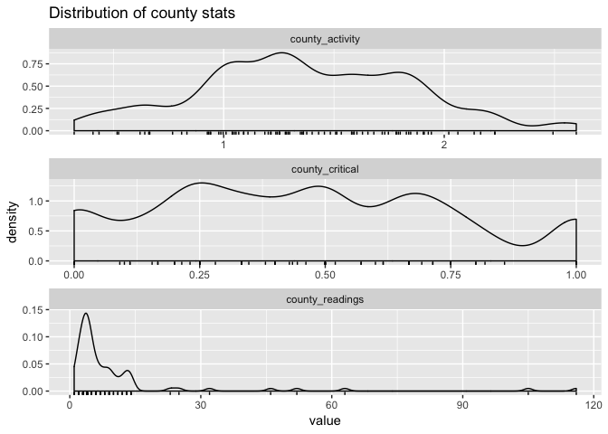
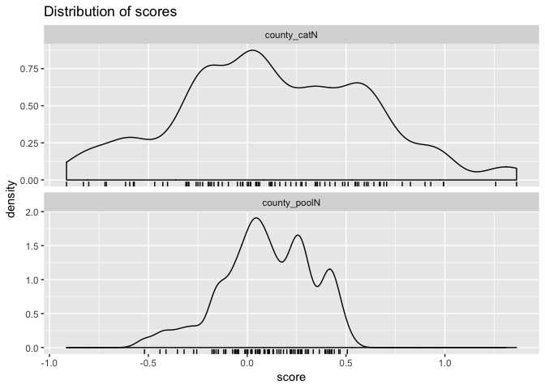

Custom Level Coding in vtreat
================
Nina Zumel, John Mount
2018-02-16

One of the services that `vtreat` provides is *level coding* (what we sometimes call *impact coding*): converting the levels of a categorical variable to a meaningful and concise single numeric variable, rather than coding them as indicator variables (AKA "one-hot encoding"). Level coding can be computationally preferable to one-hot encoding for variables that have an extremely large number of possible levels.

By default, `vtreat` level codes to the difference between the conditional means and the grand mean (`catN` variables) when the outcome is numeric, and to the difference to the conditional expectations and the global expectation of the target class (`catB` variables) when the outcome is categorical. These aren't the only possible level codings. For example, the `ranger` package can encode categorical variables as ordinals, sorted by the conditional expectations/means. While this is not a valid encoding for all possible models (it is not valid for linear or logistic regression, for example), it is valid for tree-based methods, and has the advantage of keeping the original levels distinct, which impact coding may not. That is, two levels with the same conditional expectation would be conflated by `vtreat`'s coding. This may not be a problem -- but sometimes, it may be.

So the data scientist may want to use a level coding different from what `vtreat` defaults to. In this article, we will demonstrate how to implement custom level encoders in `vtreat`. We assume you are familiar with the basics of `vtreat`: the types of derived variables, how to create and apply a treatment plan, etc.

For our example, we will implement level coders based on partial pooling, or hierarchical/multilevel models (Gelman and Hill, 2007). We'll leave the details of how partial pooling works to a subsequent article; for now, just think of it as a score that shrinks the estimate of the conditional mean to be closer to the unconditioned mean when there are too few measurements to make an accurate estimate.

We also will not execute the examples to avoid adding additional requirements to the `vtreat` package. The executed version of this example is available here.

We'll implement our partial pooling encoders using the `lmer()` (multilevel linear regression) and `glmer()` (multilevel generalized linear regression) functions from the `lme4` package. For our example data, we'll use radon levels by county for the state of Minnesota (Gelman and Hill, 2007. You can find the original data [here](http://www.stat.columbia.edu/~gelman/arm/software/)).

The Data: Radon levels in Minnesota
-----------------------------------

``` r
library("vtreat")
library("lme4")
```

    ## Loading required package: Matrix

``` r
library("dplyr")
```

    ## 
    ## Attaching package: 'dplyr'

    ## The following objects are masked from 'package:stats':
    ## 
    ##     filter, lag

    ## The following objects are masked from 'package:base':
    ## 
    ##     intersect, setdiff, setequal, union

``` r
library("tidyr")
```

    ## 
    ## Attaching package: 'tidyr'

    ## The following object is masked from 'package:Matrix':
    ## 
    ##     expand

``` r
library("ggplot2")

# example data

srrs = read.table("srrs2.dat", header=TRUE, sep=",", stringsAsFactor=FALSE)

# target: log of radon activity (activity)
# grouping variable: county
radonMN = filter(srrs, state=="MN") %>%
  select("county", "activity") %>%
  filter(activity > 0) %>% 
  mutate(activity = log(activity),
         county = base::trimws(county)) %>%
  mutate(critical = activity>1.5)

str(radonMN)
```

    ## 'data.frame':    916 obs. of  3 variables:
    ##  $ county  : chr  "AITKIN" "AITKIN" "AITKIN" "AITKIN" ...
    ##  $ activity: num  0.788 0.788 1.065 0 1.131 ...
    ##  $ critical: logi  FALSE FALSE FALSE FALSE FALSE FALSE ...

For this example we have three columns of interest:

-   `county`: 85 possible values
-   `activity`: the log of the radon reading (numerical outcome)
-   `critical`: `TRUE` when activity &gt; 1.5 (categorical outcome)

The goal is to level code `county` for either the regression problem (predict the log radon reading) or the categorization problem (predict whether the radon level is "critical").

``` r
radonMN %>% group_by(county) %>%
  summarize(county_activity = mean(activity),
            county_critical = mean(critical),
            county_readings = n()) %>%
  gather(key = measure, value=value, 
         county_activity, county_critical, county_readings) %>%
  ggplot(aes(x=value)) + 
  geom_density(adjust=0.5) + geom_rug(sides="b") + 
  facet_wrap(~measure, ncol=1, scale="free") + 
  ggtitle("Distribution of county stats")
```



As the graph shows, the conditional mean of log radon activity by county ranges from nearly zero to about 3, and the conditional expectation of a critical reading ranges from zero to one. On the other hand, the number of readings per county is quite low for many counties -- only one or two -- though some counties have a large number of readings. That means some of the conditional expectations are quite uncertain.

Implementing Level Coders for Partial Pooling
---------------------------------------------

Let's implement level coders that use partial pooling to compute the level score.

**Regression**

For regression problems, the custom coder should be a function that takes as input:

-   `v`: a string with the name of the categorical variable
-   `vcol`: the actual categorical column (assumed character)
-   `y`: the numerical outcome column
-   `weights`: a column of row weights

The function should return a column of scores (the level codings). In keeping with how the `catN` and `catB` variables are calculated, `vtreat` encodes the custom scores as deviations from the grand mean of the returned column.

For our example, the function builds a `lmer` model to predict `y` as a function of `vcol`, then returns the predictions on the training data.

``` r
# @param v character scalar: variable name
# @param vcol character vector, independent or input variable values
# @param y numeric, dependent or outcome variable to predict
# @param weights row/example weights
# @return scored training data column
ppCoderN <- function(v, vcol, 
                     y, 
                     weights) {
  # regression case y ~ vcol
  d <- data.frame(x = vcol,
                  y = y,
                  stringsAsFactors = FALSE)
  m <- lmer(y ~ (1 | x), data=d, weights=weights)
  predict(m, newdata=d)
}
```

**Categorization**

For categorization problems, the function should assume that `y` is a logical column, where `TRUE` is assumed to be the target outcome. This is because `vtreat` converts the outcome column to a logical while creating the treatment plan.

``` r
# @param v character scalar: variable name
# @param vcol chracter, independent or input variable values
# @param y logical, dependent or outcome variable to predict
# @param weights row/example weights
# @return scored training data column
ppCoderC <- function(v, vcol, 
                     y, 
                     weights) {
  # classification case y ~ vcol
  d <- data.frame(x = vcol,
                  y = y,
                  stringsAsFactors = FALSE)
  m = glmer(y ~ (1 | x), data=d, weights=weights, family=binomial)
  predict(m, newdata=d, type='link')
}
```

You can then pass the functions in as a named list into either `designTreatmentsX` or `mkCrossFrameXExperiment` to build the treatment plan. The format of the key is "\[n|c\].levelName\[.option\]\*"

The prefacing picks the model type: numeric or regression starts with 'n.' and the categorical encoder starts with 'c.'. Currently, the only supported option is 'center,' which centers the codes with respect to the estimated grand mean. The`catN` and `catB` are centered in this way.

Our example coders can be passed in as shown below.

``` r
customCoders = list('n.poolN.center' = ppCoderN, 
                    'c.poolC.center' = ppCoderC)
```

Using the Custom Coders
-----------------------

Let's build a treatment plan for the regression problem.

``` r
# I only want to create the cleaned numeric variables, the isBAD variables,
# and the level codings (not the indicator variables or catP, etc.)
vartypes_I_want = c('clean', 'isBAD', 'catN', 'poolN')

treatplanN = designTreatmentsN(radonMN, 
                               varlist = c('county'),
                               outcomename = 'activity',
                              codeRestriction = vartypes_I_want,
                              customCoders = customCoders, 
                              verbose=FALSE)

scoreFrame = treatplanN$scoreFrame
scoreFrame %>% select(varName, sig, origName, code)
```

    ##        varName          sig origName  code
    ## 1 county_poolN 8.768985e-17   county poolN
    ## 2  county_catN 1.859974e-12   county  catN

Note that the treatment plan returns both the `catN` variable (default level encoding) and the pooled level encoding (`poolN`). You can restrict to just using one coding or the other using the `codeRestriction` argument in `prepare()`.

Let's compare the two level encodings.

``` r
# create a frame with one row for every county,
measframe = data.frame(county = unique(radonMN$county),
                       stringsAsFactors=FALSE)

outframe = prepare(treatplanN, measframe)

# If we wanted only the new pooled level coding,
# (plus any numeric/isBAD variables), we would
# use a codeRestriction:
#
# outframe = prepare(treatplanN, 
#                    measframe,
#                    codeRestriction = c('clean', 'isBAD', 'poolN'))


gather(outframe, key=scoreType, value=score, 
       county_poolN, county_catN) %>%
  ggplot(aes(x=score)) + 
  geom_density(adjust=0.5) + geom_rug(sides="b") + 
  facet_wrap(~scoreType, ncol=1, scale="free_y") + 
  ggtitle("Distribution of scores")
```



Notice that the `poolN` scores are "tucked in" compared to the `catN` encoding. In a later article, we'll show that the counties with the most tucking in (or *shrinkage*) tend to be those with fewer measurements.

We can also code for the categorical problem.

``` r
# For categorical problems, coding is catB
vartypes_I_want = c('clean', 'isBAD', 'catB', 'poolC')

treatplanC = designTreatmentsC(radonMN, 
                               varlist = c('county'),
                               outcomename = 'critical',
                               outcometarget= TRUE,
                               codeRestriction = vartypes_I_want,
                               customCoders = customCoders, 
                               verbose=FALSE)

outframe = prepare(treatplanC, measframe)

gather(outframe, key=scoreType, value=linkscore, 
       county_poolC, county_catB) %>%
  ggplot(aes(x=linkscore)) + 
  geom_density(adjust=0.5) + geom_rug(sides="b") + 
  facet_wrap(~scoreType, ncol=1, scale="free_y") + 
  ggtitle("Distribution of link scores")
```


Notice that the `poolC` link scores are even more tucked in compared to the `catB` link scores, and that the `catB` scores are multimodal. The smaller link scores means that the pooled model avoids estimates of conditional expectation close to either zero or one, because, again, these estimates come from counties with few readings.

Other Considerations
--------------------

For this example, we used the `lme4` package to create custom level codings. Once calculated, `vtreat` stores the coding as a lookup table in the treatment plan. *This means `lme4` is not needed to prepare new data.* In general, using a treatment plan is not dependent on any special packages that might have been used to create it, so it can be shared with other users with no extra dependencies.

When using `mkCrossFrameXExperiment`, note that resulting cross frame will have a slightly different distribution of scores than what the treatment plan produces. This is true even for `catB` and `catN` variables. This is because the treatment plan is built using all the data, while the cross frame is built using n-fold cross validation on the data. See [the cross frame vignette](https://winvector.github.io/vtreat/articles/vtreatCrossFrames.html) for more details.

References
----------

Gelman, Andrew and Jennifer Hill. *Data Analysis Using Regression and Multilevel/Hierarchical Models*. Cambridge University Press, 2007.
