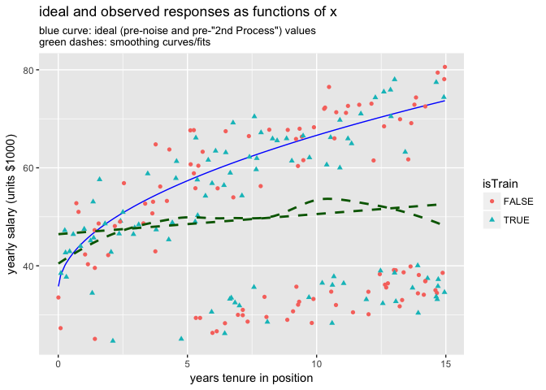
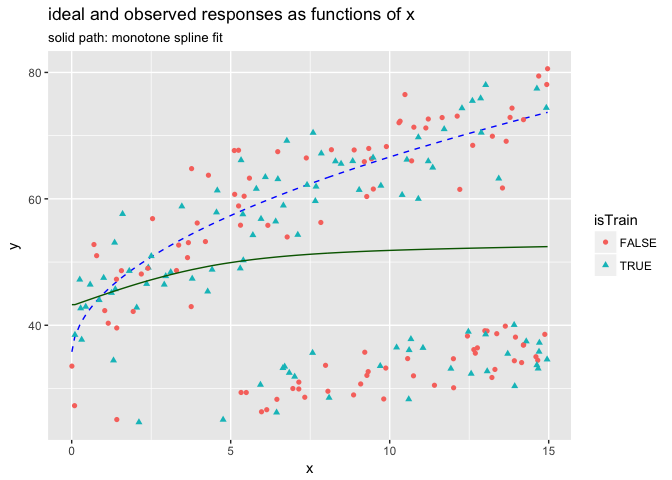

Using Isotone Coding to Find Themes
================
John Mount, Win-Vector LLC
2017-10-15

Isotone regression (please see [`vtreat` Monotone Coders](https://github.com/WinVector/vtreat/blob/master/extras/MonotoneCoder.md)).

We will use the [`vtreat` package](https://winvector.github.io/vtreat/) [custom coder interface](https://github.com/WinVector/vtreat/blob/master/extras/CustomLevelCoders.md), which will supply cross-validated significance calculations and out-of sample interpolation (allowing us to apply the monotone transforms to new data). For a more substantial application of `vtreat` custom coding please see the [partial pooling application](http://www.win-vector.com/blog/2017/09/partial-pooling-for-lower-variance-variable-encoding/).

``` r
suppressPackageStartupMessages(library("ggplot2"))
source("isotone.R")
```

Let's build a source of synthetic data. The great thing about using synthetic data when initially teaching *about* a technique is: in this case you have a better shot at knowing what the underlying *truth* you are trying to model is (as you picked it).

In our case the data is salary in `$1000`-units as a function of number of years worked in some imaginary profession. The ideal ("ideal"" meaning "unknown true"") growth function was picked as `salary ~ sqrt(tenure)` (deliberately not realistic, linear or exponential should also be considered) with two processes overlaid:

-   A noise process.
-   A drop-out process: workers are forced to half time proportional to their seniority.

``` r
mkdData <- function(nrow) {
  d <- data.frame(x = 15*runif(nrow))
  d$yIdeal <- 35 + 10*sqrt(d$x)
  d$yIdeal <- d$yIdeal
  # noise process
  d$yObserved <- d$yIdeal + 5*rnorm(nrow(d))
  # "2nd Process" forced into partial hours
  d$yObserved <- ifelse(20*runif(nrow(d))<d$x, d$yObserved/2, d$yObserved)
  d
}
```

``` r
# set up example data
set.seed(23525)
xRange = 15
d <- mkdData(200)
d$isTrain <- runif(nrow(d))<=0.5
```

When graphed the data looks like the following. Notice how the two smoothers (one `gam` the other `loess`) fail to capture the (hidden) underlying shape of the original (pre-process) system (the `gam` degenerating to linear, and the `loess` showing a hook down at the end, which is in the data but not part of the underlying idea process).

``` r
ggplot(data=d, aes(x=x)) + 
  geom_line(aes(y=yIdeal), color='blue') + 
  geom_point(aes(y=yObserved, color=isTrain, shape=isTrain)) +
  ylab('yearly salary (units $1000)') + 
  xlab('years tenure in position') +
  geom_smooth(aes(y=yObserved), method='gam', se=FALSE, linetype=2, color='darkgreen') +
  geom_smooth(aes(y=yObserved), method='loess', se=FALSE, linetype=2, color='darkgreen') +
  ggtitle("ideal and observed responses as functions of x",
          subtitle = "blue curve: ideal (pre-noise and pre-\"2nd Process\") values\ngreen dashes: smoothing curves/fits")
```



We can use direct isotone/monotone regression methods to try and find the underlying process (which itself is increasing). Neither of the noise processes are increasing- so we are hoping they get somewhat removed from the monotone inference.

``` r
customCoders = list('n.NonDecreasingV.num' = solveNonDecreasing,
                    'n.NonIncreasingV.num' = solveNonIncreasing)
treatments <- vtreat::designTreatmentsN(d[d$isTrain, , drop=FALSE], 
                                        'x', 'yObserved', 
                                        customCoders = customCoders,
                                        verbose = FALSE)
print(treatments$scoreFrame[, c('varName', 'rsq', 'sig', 'needsSplit'), drop=FALSE])
```

    ##            varName          rsq       sig needsSplit
    ## 1 x_NonDecreasingV 9.211629e-05 0.9260558       TRUE
    ## 2 x_NonIncreasingV 9.361090e-03 0.3483659       TRUE
    ## 3          x_clean 1.325225e-02 0.2640508      FALSE

``` r
dTreated <- vtreat::prepare(treatments, d)
d$soln <- dTreated$x_NonDecreasingV

dTrain <- d[d$isTrain, , drop=FALSE]

# good inference on train
sum((dTrain$yIdeal - dTrain$soln)^2)
```

    ## [1] 15116.83

``` r
sum((dTrain$yIdeal - dTrain$yObserved)^2)
```

    ## [1] 35931.14

``` r
dTest <- d[!d$isTrain, , drop=FALSE]

# good performance on test
sum((dTest$yIdeal - dTest$soln)^2)
```

    ## [1] 19157.92

``` r
sum((dTest$yIdeal - dTest$yObserved)^2)
```

    ## [1] 50580.12

``` r
ggplot(data=d, aes(x=x)) + 
  geom_line(aes(y=yIdeal), color='blue', linetype=2) + 
  geom_point(aes(y=yObserved, color=isTrain, shape=isTrain)) +
  geom_line(aes(x=x, y=soln), color='darkgreen') +
  ylab('y') +
  ggtitle("ideal and observed responses as functions of x",
          subtitle = "solid path: isotone fit")
```


Notice (modulo the decrease in expectation (a property of the observed data) and the jaggedness inherent in the direct isotone inference method): we have recovered an estimate of the original ideal shape.

The above sort of inference is *critical* in at least the following situations:

-   Trying to build models that are consistent with domain knowledge or system physics.
-   Econometric fitting (such as inferring elasticity).
-   Prescriptive fitting (such as trying to find "fair salary trends" in unfair historic data, i.e. trying to peel off even a porting of age or gender discrimination in an analysis or plan).

The ideal process was hidden from us by an omitted variable or un-labeled mixture issue. If we had a variable that recorded hours worked we could directly account for the two populations and get a good model. What we are showing with the monotone process is what can be done by using a domain-specific inductive bias (non-decreasing) in the case where we don't have the required extra variable. Better data (more and better variables) trumps complicated analysis, but sometimes the data is what it is.

To deal with the jagged fit issue we would like to use a spline. We see that unconstrained splines may not be the ideal choice (as that was what was behind one of the smoothers on the first graph). To work around that we find a model fitter that itself has a monotone or isotone option. One such fitter is in the [`R`](https://www.r-project.org) package [`scam` "Shape Constrained Additive Models"](https://CRAN.R-project.org/package=scam). By using a shape constrained spline we can simultaneously ask for:

-   Low model complexity.
-   Monotone shape.

Let's try that:

``` r
source("MonotoneSpline.R")
customCoders = list('n.NonDecreasingS.num' = solveNonDecreasingS,
                    'n.NonIncreasingS.num' = solveNonIncreasingS)
treatments <- vtreat::designTreatmentsN(d[d$isTrain, , drop=FALSE], 
                                        'x', 'yObserved', 
                                        customCoders = customCoders,
                                        verbose = FALSE)
print(treatments$scoreFrame[, c('varName', 'rsq', 'sig', 'needsSplit'), drop=FALSE])
```

    ##            varName         rsq       sig needsSplit
    ## 1 x_NonDecreasingS 0.013951634 0.2517276       TRUE
    ## 2 x_NonIncreasingS 0.005575694 0.4696519       TRUE
    ## 3          x_clean 0.013252249 0.2640508      FALSE

``` r
dTreated <- vtreat::prepare(treatments, d)
d$soln <- dTreated$x_NonDecreasingS

dTrain <- d[d$isTrain, , drop=FALSE]

# good inference on train
sum((dTrain$yIdeal - dTrain$soln)^2)
```

    ## [1] 15797.38

``` r
sum((dTrain$yIdeal - dTrain$yObserved)^2)
```

    ## [1] 35931.14

``` r
dTest <- d[!d$isTrain, , drop=FALSE]

# good performance on test
sum((dTest$yIdeal - dTest$soln)^2)
```

    ## [1] 20299.38

``` r
sum((dTest$yIdeal - dTest$yObserved)^2)
```

    ## [1] 50580.12

``` r
ggplot(data=d, aes(x=x)) + 
  geom_line(aes(y=yIdeal), color='blue', linetype=2) + 
  geom_point(aes(y=yObserved, color=isTrain, shape=isTrain)) +
  geom_line(aes(x=x, y=soln), color='darkgreen') +
  ylab('y') +
  ggtitle("ideal and observed responses as functions of x",
          subtitle = "solid path: monotone spline fit")
```



Notice the controlled spline directly at least found the shape.

However, we have found the `scam` package to be fairly sensitive to the exact relations of a large number of spline controls to the distribution of the data (get these wrong and the fit fails). We don't currently recommend using the `scam` package in for non-governed (i.e., no person on the loop) fitting production (though it can be a key part in hands-on analysis).

One idea is to fit or smooth the predictions from the raw isotone predictor with a low-degree spline. The idea is: the raw-isotone step gets a monotone data set and the low degree spine then has a good chance of not losing such structure.
