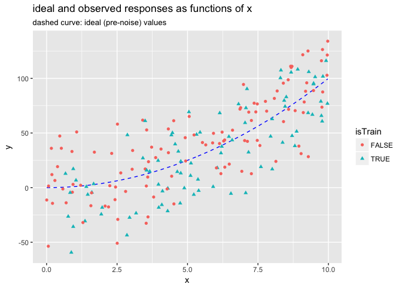

Isotone Coding in vtreat
================
John Mount, Win-Vector LLC
2017-09-30

Isotone regression.

``` r
suppressPackageStartupMessages(library("ggplot2"))
source("isotone.R")

# set up example data
set.seed(23525)
d <- data.frame(x = 10*runif(200))
d$yIdeal <- d$x^2
d$yObserved <- d$yIdeal + 25*rnorm(nrow(d))
d$isTrain <- runif(nrow(d))<=0.5

ggplot(data=d, aes(x=x)) + 
  geom_line(aes(y=yIdeal), color='blue', linetype=2) + 
  geom_point(aes(y=yObserved, color=isTrain, shape=isTrain)) +
  ylab('y') +
  ggtitle("ideal and observed responses as functions of x",
          subtitle = "dashed curve: ideal (pre-noise) values")
```



``` r
customCoders = list('n.NonDecreasingV.num' = solveNonDecreasing,
                    'n.NonIncreasingV.num' = solveNonIncreasing)
treatments <- vtreat::designTreatmentsN(d[d$isTrain, , drop=FALSE], 
                                        'x', 'yObserved', 
                                        customCoders = customCoders,
                                        verbose = FALSE)
print(treatments$scoreFrame[, c('varName', 'rsq', 'sig', 'needsSplit'), drop=FALSE])
```

    ##            varName       rsq          sig needsSplit
    ## 1 x_NonDecreasingV 0.5809673 9.905695e-18       TRUE
    ## 2          x_clean 0.6129088 3.320652e-19      FALSE

``` r
dTreated <- vtreat::prepare(treatments, d)
d$soln <- dTreated$x_NonDecreasingV

dTrain <- d[d$isTrain, , drop=FALSE]

# good inference on train
sum((dTrain$yIdeal - dTrain$soln)^2)
```

    ## [1] 7460.391

``` r
sum((dTrain$yIdeal - dTrain$yObserved)^2)
```

    ## [1] 60855.41

``` r
dTest <- d[!d$isTrain, , drop=FALSE]

# good performance on test
sum((dTest$yIdeal - dTest$soln)^2)
```

    ## [1] 14315.25

``` r
sum((dTest$yIdeal - dTest$yObserved)^2)
```

    ## [1] 75152.66

``` r
ggplot(data=d, aes(x=x)) + 
  geom_line(aes(y=yIdeal), color='blue', linetype=2) + 
  geom_point(aes(y=yObserved, color=isTrain, shape=isTrain)) +
  geom_line(data= dTrain, aes(x=x, y=soln), color='darkgreen') +
  ylab('y') +
  ggtitle("ideal and observed responses as functions of x",
          subtitle = "solid path: isotone fit")
```


Can also easily adapt to classification and to categorical inputs.

``` r
suppressPackageStartupMessages(library("ggplot2"))
source("isotone.R")

# set up example data
set.seed(23525)
d <- data.frame(x = 10*runif(200))
d$yIdeal <- -d$x^2
d$yObserved <- d$yIdeal + 25*rnorm(nrow(d))
d$isTrain <- runif(nrow(d))<=0.5
threshold <- -50
d$yIdeal <- ifelse(d$yIdeal >= threshold, 1.0, 0.0)
d$yObserved <- ifelse(d$yObserved >= threshold, 1.0, 0.0)

ggplot(data=d, aes(x=x)) + 
  geom_line(aes(y=yIdeal), color='blue', linetype=2) + 
  geom_point(aes(y=yObserved, color=isTrain, shape=isTrain), alpha=0.5) + 
  ylab('y') +
  ggtitle("ideal and observed responses as functions of x",
          subtitle = "dashed curve: ideal (pre-noise) values")
```


``` r
# could also build link-space versions
customCoders = list('c.NonDecreasingV.num' = solveNonDecreasing,
                    'c.NonIncreasingV.num' = solveNonIncreasing)
treatments <- vtreat::designTreatmentsC(d[d$isTrain, , drop=FALSE], 
                                        'x', 'yObserved', 1,
                                        customCoders = customCoders,
                                        verbose = FALSE)
print(treatments$scoreFrame[, c('varName', 'rsq', 'sig', 'needsSplit'), drop=FALSE])
```

    ##            varName       rsq          sig needsSplit
    ## 1 x_NonIncreasingV 0.3370146 2.856172e-10       TRUE
    ## 2          x_clean 0.3522417 1.138713e-10      FALSE

``` r
dTreated <- vtreat::prepare(treatments, d)
d$soln <- dTreated$x_NonIncreasingV

dTrain <- d[d$isTrain, , drop=FALSE]

# good inference on train
sum((dTrain$yIdeal - dTrain$soln)^2)
```

    ## [1] 4.390476

``` r
sum((dTrain$yIdeal - dTrain$yObserved)^2)
```

    ## [1] 16

``` r
dTest <- d[!d$isTrain, , drop=FALSE]

# good performance on test
sum((dTest$yIdeal - dTest$soln)^2)
```

    ## [1] 4.860317

``` r
sum((dTest$yIdeal - dTest$yObserved)^2)
```

    ## [1] 26

``` r
ggplot(data=d, aes(x=x)) + 
  geom_line(aes(y=yIdeal), color='blue', linetype=2) + 
  geom_point(aes(y=yObserved, color=isTrain, shape=isTrain)) +
  geom_line(data= dTrain, aes(x=x, y=soln), color='darkgreen') +
  ylab('y') +
  ggtitle("ideal and observed responses as functions of x",
          subtitle = "solid path: isotone fit")
```


