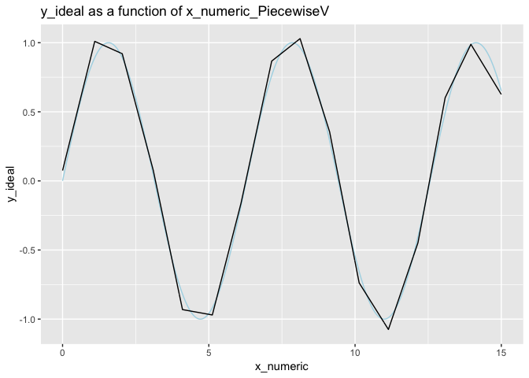

SegFitter
================

``` r
library("ggplot2")
```

``` r
customCoders = list('c.PiecewiseV.num' = vtreat::solve_piecewise,
                    'n.PiecewiseV.num' = vtreat::solve_piecewise,
                    'c.knearest.num' = vtreat::square_window,
                    'n.knearest.num' = vtreat::square_window)
codeRestriction = c("PiecewiseV", 
                    "knearest",
                    "clean", "isBAD", "catB", "catP")
```

``` r
d <- data.frame(x_numeric = seq(0, 15, by = 0.01))
d$x_cat <- paste0("l_", round(d$x_numeric, digits = 1))
d$y_ideal <- sin(d$x_numeric)
d$x_numeric_noise <- d$x_numeric[sample.int(nrow(d), nrow(d), replace = FALSE)]
d$x_cat_noise <- d$x_cat[sample.int(nrow(d), nrow(d), replace = FALSE)]
d$y <- d$y_ideal + 0.5*rnorm(nrow(d))
d$yc <- d$y>0.5
d$is_train <- runif(nrow(d))>=0.2

head(d)
```

    ##   x_numeric x_cat     y_ideal x_numeric_noise x_cat_noise           y
    ## 1      0.00   l_0 0.000000000           10.51       l_9.9 -0.62121696
    ## 2      0.01   l_0 0.009999833           11.82      l_13.4 -1.11134033
    ## 3      0.02   l_0 0.019998667           10.70      l_10.5 -0.08859367
    ## 4      0.03   l_0 0.029995500            5.63       l_8.2  0.75832653
    ## 5      0.04   l_0 0.039989334           11.88       l_9.5 -0.65319848
    ## 6      0.05   l_0 0.049979169           12.14      l_14.4  0.23490436
    ##      yc is_train
    ## 1 FALSE    FALSE
    ## 2 FALSE     TRUE
    ## 3 FALSE     TRUE
    ## 4  TRUE     TRUE
    ## 5 FALSE     TRUE
    ## 6 FALSE     TRUE

``` r
summary(d)
```

    ##    x_numeric        x_cat              y_ideal        x_numeric_noise
    ##  Min.   : 0.00   Length:1501        Min.   :-1.0000   Min.   : 0.00  
    ##  1st Qu.: 3.75   Class :character   1st Qu.:-0.5917   1st Qu.: 3.75  
    ##  Median : 7.50   Mode  :character   Median : 0.2412   Median : 7.50  
    ##  Mean   : 7.50                      Mean   : 0.1174   Mean   : 7.50  
    ##  3rd Qu.:11.25                      3rd Qu.: 0.8104   3rd Qu.:11.25  
    ##  Max.   :15.00                      Max.   : 1.0000   Max.   :15.00  
    ##  x_cat_noise              y               yc           is_train      
    ##  Length:1501        Min.   :-2.1462   Mode :logical   Mode :logical  
    ##  Class :character   1st Qu.:-0.5683   FALSE:943       FALSE:303      
    ##  Mode  :character   Median : 0.1391   TRUE :558       TRUE :1198     
    ##                     Mean   : 0.1058                                  
    ##                     3rd Qu.: 0.7620                                  
    ##                     Max.   : 2.3191

``` r
ggplot(data=d) +
  geom_point(aes(x = x_numeric, y = y, color = yc), alpha=0.5) + 
  geom_line(aes(x = x_numeric, y = y_ideal), color = "lightblue") +
  geom_hline(yintercept = 0.5, color = "red")
```


``` r
cfn <- vtreat::mkCrossFrameNExperiment(
  d[d$is_train, , drop=FALSE], 
  c('x_numeric', 'x_numeric_noise', 'x_cat', 'x_cat_noise'), 'y',
  customCoders = customCoders,
  codeRestriction = codeRestriction,
  verbose = FALSE)

cfn$treatments
```

    ##                      varName varMoves          rsq           sig
    ## 1       x_numeric_PiecewiseV     TRUE 6.436318e-01 3.118943e-270
    ## 2         x_numeric_knearest     TRUE 6.450728e-01 2.762233e-271
    ## 3            x_numeric_clean     TRUE 2.665001e-03  7.407812e-02
    ## 4 x_numeric_noise_PiecewiseV     TRUE 7.354248e-03  2.972136e-03
    ## 5   x_numeric_noise_knearest     TRUE 8.750468e-04  3.062969e-01
    ## 6      x_numeric_noise_clean     TRUE 1.951845e-05  8.785903e-01
    ## 7                 x_cat_catP     TRUE 1.142751e-03  2.423384e-01
    ## 8           x_cat_noise_catP     TRUE 7.909056e-05  7.584625e-01
    ##   needsSplit extraModelDegrees        origName       code
    ## 1       TRUE              1198       x_numeric PiecewiseV
    ## 2       TRUE              1198       x_numeric   knearest
    ## 3      FALSE                 0       x_numeric      clean
    ## 4       TRUE              1198 x_numeric_noise PiecewiseV
    ## 5       TRUE              1198 x_numeric_noise   knearest
    ## 6      FALSE                 0 x_numeric_noise      clean
    ## 7       TRUE               150           x_cat       catP
    ## 8       TRUE               150     x_cat_noise       catP

``` r
vtreat::variable_values(cfn$treatments$scoreFrame)
```

    ##                          rsq count           sig             var
    ## x_cat           1.142751e-03     1  2.423384e-01           x_cat
    ## x_cat_noise     7.909056e-05     1  7.584625e-01     x_cat_noise
    ## x_numeric       6.450728e-01     3 8.286699e-271       x_numeric
    ## x_numeric_noise 7.354248e-03     3  8.916408e-03 x_numeric_noise

``` r
# or directly
vtreat::value_variables_N(
  d[d$is_train, , drop=FALSE], 
  c('x_numeric', 'x_numeric_noise', 'x_cat', 'x_cat_noise'), 'y')
```

    ##                          rsq count           sig             var
    ## x_cat           8.097485e-04     1  3.250679e-01           x_cat
    ## x_cat_noise     8.362445e-05     1  7.518570e-01     x_cat_noise
    ## x_numeric       6.512157e-01     3 2.410232e-275       x_numeric
    ## x_numeric_noise 6.854982e-04     3  1.000000e+00 x_numeric_noise

``` r
prepared <- vtreat::prepare(cfn$treatments, d)
d$x_numeric_PiecewiseV <- prepared$x_numeric_PiecewiseV
d$x_numeric_knearest <- prepared$x_numeric_knearest

ggplot(data=d) +
  # geom_point(aes(x = x_numeric, y = y)) + 
  geom_line(aes(x = x_numeric, y = y_ideal), color = "lightblue") + 
  geom_line(aes(x = x_numeric, y = x_numeric_PiecewiseV)) +
  ggtitle("y_ideal as a function of x_numeric_PiecewiseV")
```



``` r
ggplot(data=d) +
  # geom_point(aes(x = x_numeric, y = y)) + 
  geom_line(aes(x = x_numeric, y = y_ideal), color = "lightblue") + 
  geom_line(aes(x = x_numeric, y = x_numeric_knearest)) +
  ggtitle("y_ideal as a function of x_numeric_knearest")
```


``` r
WVPlots::ScatterHist(d[d$is_train, , drop=FALSE], 
                     "x_numeric_PiecewiseV", "y",
                     "x_numeric_PiecewiseV versus observed y on train",
                     smoothmethod = "identity",
                     estimate_sig = TRUE)
```


``` r
WVPlots::ScatterHist(d[d$is_train, , drop=FALSE], 
                     "x_numeric_PiecewiseV", "y_ideal",
                     "x_numeric_PiecewiseV versus ideal y on train",
                     smoothmethod = "identity",
                     estimate_sig = TRUE)
```


``` r
WVPlots::ScatterHist(d[!d$is_train, , drop=FALSE], 
                     "x_numeric_PiecewiseV", "y",
                     "x_numeric_PiecewiseV versus observed y on test",
                     smoothmethod = "identity",
                     estimate_sig = TRUE)
```


``` r
WVPlots::ScatterHist(d[!d$is_train, , drop=FALSE], 
                     "x_numeric_PiecewiseV", "y_ideal",
                     "x_numeric_PiecewiseV versus ideal y on test",
                     smoothmethod = "identity",
                     estimate_sig = TRUE)
```


``` r
cfc <- vtreat::mkCrossFrameCExperiment(
  d[d$is_train, , drop=FALSE], 
  c('x_numeric', 'x_numeric_noise', 'x_cat', 'x_cat_noise'), 'yc', TRUE,
  customCoders = customCoders,
  codeRestriction = codeRestriction,
  verbose = FALSE)

cfc$treatments
```

    ##                       varName varMoves          rsq           sig
    ## 1        x_numeric_PiecewiseV     TRUE 3.779647e-01 1.275458e-132
    ## 2          x_numeric_knearest     TRUE 3.680384e-01 3.437535e-129
    ## 3             x_numeric_clean     TRUE 1.035170e-03  1.996726e-01
    ## 4  x_numeric_noise_PiecewiseV     TRUE 1.597915e-05  8.734014e-01
    ## 5    x_numeric_noise_knearest     TRUE 3.464061e-04  4.581543e-01
    ## 6       x_numeric_noise_clean     TRUE 3.250653e-04  4.723420e-01
    ## 7                  x_cat_catP     TRUE 8.194517e-04  2.538453e-01
    ## 8                  x_cat_catB     TRUE 2.775466e-01  6.591308e-98
    ## 9            x_cat_noise_catP     TRUE 1.254962e-03  1.579241e-01
    ## 10           x_cat_noise_catB     TRUE 1.441914e-03  1.301229e-01
    ##    needsSplit extraModelDegrees        origName       code
    ## 1        TRUE              1198       x_numeric PiecewiseV
    ## 2        TRUE              1198       x_numeric   knearest
    ## 3       FALSE                 0       x_numeric      clean
    ## 4        TRUE              1198 x_numeric_noise PiecewiseV
    ## 5        TRUE              1198 x_numeric_noise   knearest
    ## 6       FALSE                 0 x_numeric_noise      clean
    ## 7        TRUE               150           x_cat       catP
    ## 8        TRUE               150           x_cat       catB
    ## 9        TRUE               150     x_cat_noise       catP
    ## 10       TRUE               150     x_cat_noise       catB

``` r
vtreat::variable_values(cfc$treatments$scoreFrame)
```

    ##                          rsq count           sig             var
    ## x_cat           0.2775465768     2  1.318262e-97           x_cat
    ## x_cat_noise     0.0014419137     2  2.602458e-01     x_cat_noise
    ## x_numeric       0.3779647266     3 3.826373e-132       x_numeric
    ## x_numeric_noise 0.0003464061     3  1.000000e+00 x_numeric_noise

``` r
# or directly
vtreat::value_variables_C(
  d[d$is_train, , drop=FALSE], 
  c('x_numeric', 'x_numeric_noise', 'x_cat', 'x_cat_noise'), 'yc', TRUE)
```

    ##                          rsq count           sig             var
    ## x_cat           0.2786231001     2  5.594228e-98           x_cat
    ## x_cat_noise     0.0007950383     2  5.220828e-01     x_cat_noise
    ## x_numeric       0.3714943316     3 6.591061e-130       x_numeric
    ## x_numeric_noise 0.0011724530     3  5.168731e-01 x_numeric_noise
