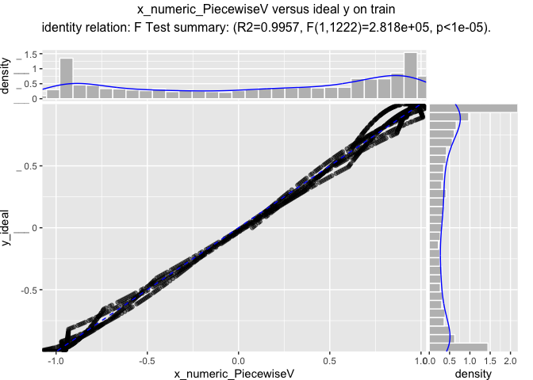
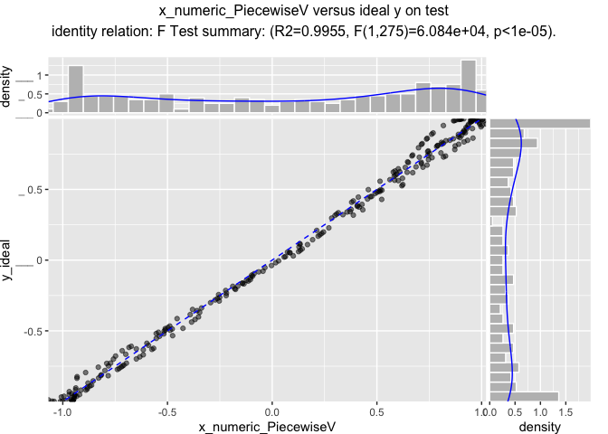

SegFitter
================

``` r
library("ggplot2")
```

``` r
customCoders = list('c.PiecewiseV.num' = vtreat::solve_piecewise,
                    'n.PiecewiseV.num' = vtreat::solve_piecewise,
                    'c.knearest.num' = vtreat::square_window,
                    'n.knearest.num' = vtreat::square_window)
codeRestriction = c("PiecewiseV", 
                    "knearest",
                    "clean", "isBAD", "catB", "catP")
```

``` r
d <- data.frame(x_numeric = seq(0, 15, by = 0.01))
d$x_cat <- paste0("l_", round(d$x_numeric, digits = 1))
d$y_ideal <- sin(d$x_numeric)
d$x_numeric_noise <- d$x_numeric[sample.int(nrow(d), nrow(d), replace = FALSE)]
d$x_cat_noise <- d$x_cat[sample.int(nrow(d), nrow(d), replace = FALSE)]
d$y <- d$y_ideal + 0.5*rnorm(nrow(d))
d$yc <- d$y>0.5
d$is_train <- runif(nrow(d))>=0.2

head(d)
```

    ##   x_numeric x_cat     y_ideal x_numeric_noise x_cat_noise          y    yc
    ## 1      0.00   l_0 0.000000000           10.47      l_12.5 -0.8299740 FALSE
    ## 2      0.01   l_0 0.009999833            8.32      l_11.3 -0.5689651 FALSE
    ## 3      0.02   l_0 0.019998667           11.47        l_13 -0.1648827 FALSE
    ## 4      0.03   l_0 0.029995500            5.47       l_1.3  0.3743689 FALSE
    ## 5      0.04   l_0 0.039989334            8.63       l_5.6 -0.5102987 FALSE
    ## 6      0.05   l_0 0.049979169            3.63      l_10.9 -0.1944137 FALSE
    ##   is_train
    ## 1     TRUE
    ## 2     TRUE
    ## 3     TRUE
    ## 4     TRUE
    ## 5    FALSE
    ## 6     TRUE

``` r
summary(d)
```

    ##    x_numeric        x_cat              y_ideal        x_numeric_noise
    ##  Min.   : 0.00   Length:1501        Min.   :-1.0000   Min.   : 0.00  
    ##  1st Qu.: 3.75   Class :character   1st Qu.:-0.5917   1st Qu.: 3.75  
    ##  Median : 7.50   Mode  :character   Median : 0.2412   Median : 7.50  
    ##  Mean   : 7.50                      Mean   : 0.1174   Mean   : 7.50  
    ##  3rd Qu.:11.25                      3rd Qu.: 0.8104   3rd Qu.:11.25  
    ##  Max.   :15.00                      Max.   : 1.0000   Max.   :15.00  
    ##  x_cat_noise              y               yc           is_train      
    ##  Length:1501        Min.   :-2.3449   Mode :logical   Mode :logical  
    ##  Class :character   1st Qu.:-0.5260   FALSE:943       FALSE:286      
    ##  Mode  :character   Median : 0.1567   TRUE :558       TRUE :1215     
    ##                     Mean   : 0.1156                                  
    ##                     3rd Qu.: 0.7463                                  
    ##                     Max.   : 2.4197

``` r
ggplot(data=d) +
  geom_point(aes(x = x_numeric, y = y, color = yc), alpha=0.5) + 
  geom_line(aes(x = x_numeric, y = y_ideal), color = "lightblue") +
  geom_hline(yintercept = 0.5, color = "red")
```


``` r
cfn <- vtreat::mkCrossFrameNExperiment(
  d[d$is_train, , drop=FALSE], 
  c('x_numeric', 'x_numeric_noise', 'x_cat', 'x_cat_noise'), 'y',
  customCoders = customCoders,
  codeRestriction = codeRestriction,
  verbose = FALSE)

cfn$treatments
```

    ##                      varName varMoves          rsq           sig
    ## 1       x_numeric_PiecewiseV     TRUE 6.513711e-01 7.873750e-280
    ## 2         x_numeric_knearest     TRUE 6.370701e-01 3.090969e-269
    ## 3            x_numeric_clean     TRUE 6.871590e-05  7.728465e-01
    ## 4 x_numeric_noise_PiecewiseV     TRUE 6.034739e-05  7.867711e-01
    ## 5   x_numeric_noise_knearest     TRUE 5.988362e-04  3.940830e-01
    ## 6      x_numeric_noise_clean     TRUE 2.821012e-04  5.586219e-01
    ## 7                 x_cat_catP     TRUE 2.211212e-03  1.013568e-01
    ## 8           x_cat_noise_catP     TRUE 1.316171e-04  6.895285e-01
    ##   needsSplit extraModelDegrees        origName       code
    ## 1       TRUE              1215       x_numeric PiecewiseV
    ## 2       TRUE              1215       x_numeric   knearest
    ## 3      FALSE                 0       x_numeric      clean
    ## 4       TRUE              1215 x_numeric_noise PiecewiseV
    ## 5       TRUE              1215 x_numeric_noise   knearest
    ## 6      FALSE                 0 x_numeric_noise      clean
    ## 7       TRUE               150           x_cat       catP
    ## 8       TRUE               150     x_cat_noise       catP

``` r
vtreat::variable_values(cfn$treatments$scoreFrame)
```

    ##                          rsq count           sig             var
    ## x_cat           0.0022112123     1  1.013568e-01           x_cat
    ## x_cat_noise     0.0001316171     1  6.895285e-01     x_cat_noise
    ## x_numeric       0.6513711351     3 2.362125e-279       x_numeric
    ## x_numeric_noise 0.0005988362     3  1.000000e+00 x_numeric_noise

``` r
# or directly
vtreat::value_variables_N(
  d[d$is_train, , drop=FALSE], 
  c('x_numeric', 'x_numeric_noise', 'x_cat', 'x_cat_noise'), 'y')
```

    ##                          rsq count           sig             var
    ## x_cat           0.0001051641     1  7.210192e-01           x_cat
    ## x_cat_noise     0.0016164861     1  1.613449e-01     x_cat_noise
    ## x_numeric       0.6565288816     3 2.790286e-283       x_numeric
    ## x_numeric_noise 0.0004475751     3  1.000000e+00 x_numeric_noise

``` r
prepared <- vtreat::prepare(cfn$treatments, d)
d$x_numeric_PiecewiseV <- prepared$x_numeric_PiecewiseV
d$x_numeric_knearest <- prepared$x_numeric_knearest

ggplot(data=d) +
  # geom_point(aes(x = x_numeric, y = y)) + 
  geom_line(aes(x = x_numeric, y = y_ideal), color = "lightblue") + 
  geom_line(aes(x = x_numeric, y = x_numeric_PiecewiseV)) +
  ggtitle("y_ideal as a function of x_numeric_PiecewiseV")
```


``` r
ggplot(data=d) +
  # geom_point(aes(x = x_numeric, y = y)) + 
  geom_line(aes(x = x_numeric, y = y_ideal), color = "lightblue") + 
  geom_line(aes(x = x_numeric, y = x_numeric_knearest)) +
  ggtitle("y_ideal as a function of x_numeric_knearest")
```


``` r
WVPlots::ScatterHist(d[d$is_train, , drop=FALSE], 
                     "x_numeric_PiecewiseV", "y",
                     "x_numeric_PiecewiseV versus observed y on train",
                     smoothmethod = "identity",
                     estimate_sig = TRUE)
```


``` r
WVPlots::ScatterHist(d[d$is_train, , drop=FALSE], 
                     "x_numeric_PiecewiseV", "y_ideal",
                     "x_numeric_PiecewiseV versus ideal y on train",
                     smoothmethod = "identity",
                     estimate_sig = TRUE)
```



``` r
WVPlots::ScatterHist(d[!d$is_train, , drop=FALSE], 
                     "x_numeric_PiecewiseV", "y",
                     "x_numeric_PiecewiseV versus observed y on test",
                     smoothmethod = "identity",
                     estimate_sig = TRUE)
```


``` r
WVPlots::ScatterHist(d[!d$is_train, , drop=FALSE], 
                     "x_numeric_PiecewiseV", "y_ideal",
                     "x_numeric_PiecewiseV versus ideal y on test",
                     smoothmethod = "identity",
                     estimate_sig = TRUE)
```



``` r
cfc <- vtreat::mkCrossFrameCExperiment(
  d[d$is_train, , drop=FALSE], 
  c('x_numeric', 'x_numeric_noise', 'x_cat', 'x_cat_noise'), 'yc', TRUE,
  customCoders = customCoders,
  codeRestriction = codeRestriction,
  verbose = FALSE)

cfc$treatments
```

    ##                       varName varMoves          rsq           sig
    ## 1        x_numeric_PiecewiseV     TRUE 3.702529e-01 8.086351e-131
    ## 2          x_numeric_knearest     TRUE 3.668654e-01 1.220071e-129
    ## 3             x_numeric_clean     TRUE 4.407704e-04  4.010893e-01
    ## 4  x_numeric_noise_PiecewiseV     TRUE 1.450019e-07  9.878489e-01
    ## 5    x_numeric_noise_knearest     TRUE 1.519889e-03  1.189403e-01
    ## 6       x_numeric_noise_clean     TRUE 3.053558e-04  4.846203e-01
    ## 7                  x_cat_catP     TRUE 4.909104e-04  3.755366e-01
    ## 8                  x_cat_catB     TRUE 3.006003e-01 1.401671e-106
    ## 9            x_cat_noise_catP     TRUE 2.085029e-04  5.635925e-01
    ## 10           x_cat_noise_catB     TRUE 2.874233e-04  4.977345e-01
    ##    needsSplit extraModelDegrees        origName       code
    ## 1        TRUE              1215       x_numeric PiecewiseV
    ## 2        TRUE              1215       x_numeric   knearest
    ## 3       FALSE                 0       x_numeric      clean
    ## 4        TRUE              1215 x_numeric_noise PiecewiseV
    ## 5        TRUE              1215 x_numeric_noise   knearest
    ## 6       FALSE                 0 x_numeric_noise      clean
    ## 7        TRUE               150           x_cat       catP
    ## 8        TRUE               150           x_cat       catB
    ## 9        TRUE               150     x_cat_noise       catP
    ## 10       TRUE               150     x_cat_noise       catB

``` r
vtreat::variable_values(cfc$treatments$scoreFrame)
```

    ##                          rsq count           sig             var
    ## x_cat           0.3006003157     2 2.803343e-106           x_cat
    ## x_cat_noise     0.0002874233     2  9.954690e-01     x_cat_noise
    ## x_numeric       0.3702529323     3 2.425905e-130       x_numeric
    ## x_numeric_noise 0.0015198886     3  3.568209e-01 x_numeric_noise

``` r
# or directly
vtreat::value_variables_C(
  d[d$is_train, , drop=FALSE], 
  c('x_numeric', 'x_numeric_noise', 'x_cat', 'x_cat_noise'), 'yc', TRUE)
```

    ##                          rsq count           sig             var
    ## x_cat           0.3122584605     2 2.454683e-110           x_cat
    ## x_cat_noise     0.0018866829     2  1.646955e-01     x_cat_noise
    ## x_numeric       0.3900519342     3 3.136345e-137       x_numeric
    ## x_numeric_noise 0.0004443115     3  1.000000e+00 x_numeric_noise
