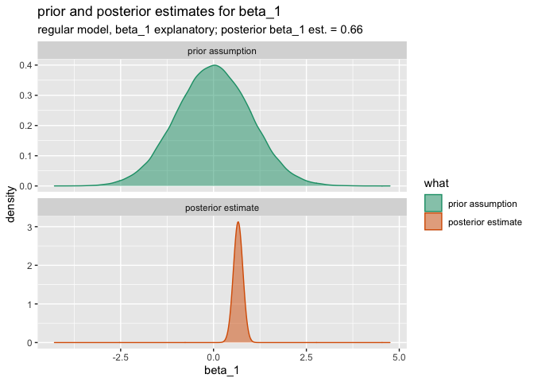
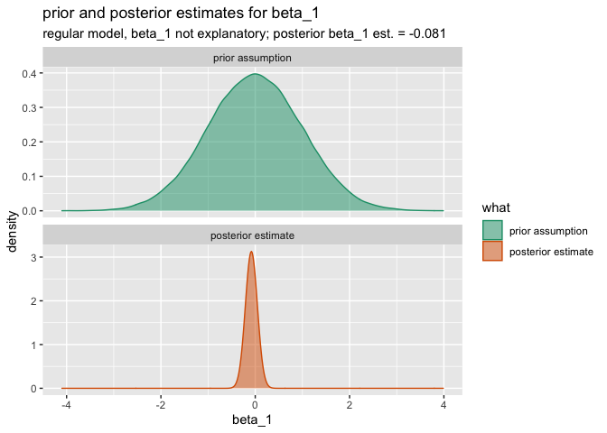
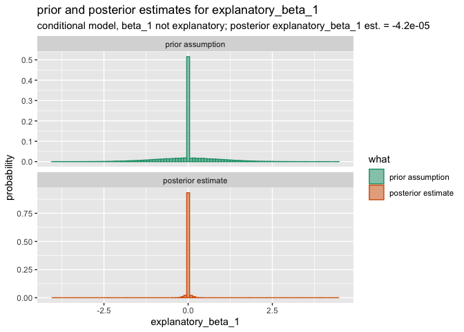
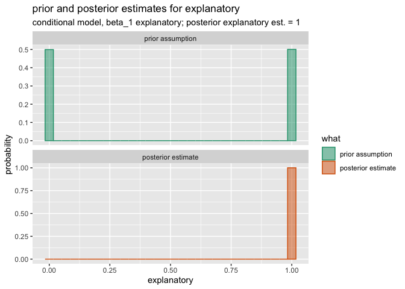

Don’t Feel Guilty About Selecting Variables
================
John Mount
2020-05-30

## Introduction

Feature selection or feature pruning is the removal of some proposed
columns or potential explanatory variables from a model. It can be an
important step in data science, where many available data columns are
not in fact pre-screened as suitable for a given project. In fact one
could say that what a statistician calls an explanatory variable has
already been filtered for problem appropriateness, so you sometimes
don’t see variable selection in statistics because we are often
starting statistical stories after the variable qualification chapter\!

We recommend incorporating mild feature pruning into your machine
learning and modeling workflows. It is empirically known that feature
selection can help (for example
[here](http://www.win-vector.com/blog/2014/02/bad-bayes-an-example-of-why-you-need-hold-out-testing/)
and [here](https://dl.acm.org/doi/10.1145/1964897.1964901)). It is also
known one can introduce problems if feature selection is done improperly
(for example [Freedman’s
paradox](https://en.wikipedia.org/wiki/Freedman%27s_paradox). The issues
are avoidable, by using out of sample methods, [cross
methods](http://www.win-vector.com/blog/2020/03/cross-methods-are-a-leak-variance-trade-off/),
or [differential
privacy](http://www.win-vector.com/blog/2015/10/a-simpler-explanation-of-differential-privacy/)).
We have also always felt a bit exposed in this, as feature selection
*seems* unjustified in standard explanations of regression. One *feels*
that if a coefficient were meant to be zero, the fitting procedure would
have set it to zero. Under this misapprehension, stepping in and
removing some variables *feels* unjustified.

Regardless of intuition or feelings, it is a fair question: is variable
selection a natural justifiable part of modeling? Or is it something
that is already done (therefore redundant). Or is it something that is
not done for important reasons (such as avoiding damaging bias)?

In [this
note](https://github.com/WinVector/vtreat/blob/master/extras/VariablePruning/Variable_Selection.md)
we will show that feature selection *is* in fact an obvious justified
step when using a sufficiently sophisticated model of regression. This
note is long, as it defines so many tiny elementary steps. However this
note ends with a big point: variable selection *is* justified. It
naturally appears in the right variation of Bayesian Regression. You
*should* select variables, using your preferred methodology. And you
*shouldn’t* feel bad about selecting variables.

## Bayesian Regression in Action

To work towards variable selection/pruning, let’s work a specific
Bayesian Regression example in [`R`](https://www.r-project.org). We are
going to use the direct generative method described in the last section
instead of a package such as
[`rstan`](https://CRAN.R-project.org/package=rstan) or
[`lme4`](https://CRAN.R-project.org/package=lme4). This is because:

  - We want to follow the exact didactic path above, in anticipation of
    adding variable selection.
  - [`rstan` doesn’t allow direct unobserved discrete
    parameters](https://mc-stan.org/docs/2_23/stan-users-guide/latent-discrete-parameterization.html)
    (a tool we will find convenient for variable selection).
  - We can get away with the direct method because our problem is low
    dimensional.

First we prepare our `R` environment.

``` r
library(wrapr)
library(ggplot2)
source('fns.R')

set.seed(2020)

cl <- parallel::makeCluster(parallel::detectCores())
```

The source to `fns.R` and the mathematical derivations of all the steps
can be found in the long-version of this article
[here](https://github.com/WinVector/vtreat/blob/master/extras/VariablePruning/Variable_Selection_w_Appendices.pdf).

Now we define our functions. The first generates our proposed parameters
`beta_0` and `beta_1`. The idea is: since the vector parameters were
generated according to the normal distribution, picking one of them
uniformly from the stored `data.frame` is also normally distributed.

``` r
generate_params <- function(
  ...,  # force arguments to bind by name
  n_sample = 100000,
  prior_mean_beta_0 = 0,
  prior_sd_beta_0 = 1,
  prior_mean_beta_1 = 0,
  prior_sd_beta_1 = 1,
  prior_explanatory_prob = 0.5) {
  stop_if_dot_args(
    substitute(list(...)), 
    "generate_params")
  params <- data.frame(
    explanatory = rbinom(
      n = n_sample, 
      size = 1, prob = 
        prior_explanatory_prob),
    beta_0 = rnorm(
      n = n_sample, 
      mean = prior_mean_beta_0, 
      sd = prior_sd_beta_0),
    beta_1 = rnorm(
      n = n_sample, 
      mean = prior_mean_beta_1, 
      sd = prior_sd_beta_1),
    prior_weight = 1/n_sample
  )
  return(params)
}
```

`explanatory` is a random variable that is always `0` or `1`. We will
use it later to perform variable selection. For now it is not used.

Now we define functions to compute `P[data | parameters]`. We want to
know `P[parameters | data]`, but we know with our above derivation if we
can estimate `P[data | parameters]`, then using Bayes’ Law we can get
the desired `P[data | parameters]`.

``` r
# per setting parameter calculation function
mk_fun_p_data_given_params <- function(params, data, sd_noise) {
    force(params)
    force(data)
    force(sd_noise)
    function(i) {
      pi <- params[i, , drop = FALSE]
      ei <- data$y - (pi$beta_1 * data$x  + pi$beta_0)
      sum(dnorm(ei, mean=0, sd = sd_noise, log = TRUE))
    }
}
```

`mk_fun_p_data_given_params` realizes the following probability model:
parameterss are plausible if `data$y - (pi$beta_1 * data$x + pi$beta_0)`
is small.All of the definitions and math are to justify this block of
code. `mk_fun_p_data_given_params` embodies the generative model
illustrated in the following dependency diagram. The only important bit
is the starement `ei <- data$y - (pi$beta_1 * data$x + pi$beta_0)`.

<p/>


<p/>

With this model defined we can run some
experiments.

#### Experiment 1: Standard Bayesian Inference with `beta_1` explanatory.

We can now run our first experiment.

First we generate our observed data `d$x` and `d$y`.

``` r
n_example <- 100
actual_b1 <- 0.7
actual_b0 <- 0.3

d <- data.frame(x = rnorm(n_example))
d$y <- actual_b1 * d$x + actual_b0 + rnorm(nrow(d), mean = 0, sd = 1)
```

Notice `d$y` is `0.7 * d$x + 0.3` with mean zero standard deviation one
noise. A good fitting procedure should recover the coefficients `beta_0
= 0.3` and `beta_1 = 0.7`.

Our Bayesian fitting procedure is as follows.

First: propose many possible values of the fit coefficients `beta_0`,
`beta_1`, each with probability according to the assumed prior
distributions.

``` r
params <- generate_params()
```

Second: compute the posterior plausibility of all of the coefficient
proposals with respect to the observed data. This is just us using
Bayes’ Law to criticize all of the proposed coefficient combinations.
The least criticized is considered the best.

``` r
params$posterior_weight <- p_data_given_params(
  params = params,
  data = d,
  fn_factory = mk_fun_p_data_given_params)
```

This sampling or inference process can be summarized with the following
diagram.

<p/>


<p/>

In Bayesian methods: having access to a description of or samples from
the posterior distribution is pretty much the same as inferring the
parameters or solving the problem. This may same alien or weird; but it
is why we consider the problem solved if we can get an estimate or
approximation of the posterior distribution.

And we now have our coefficient estimates.

For `beta_0` we have:

``` r
plot_parameter(
  params, 'beta_0', 
  subtitle = 'regular model, beta_1 explanatory')
```

<!-- -->

The above plot is two facets or panels. In each facet the x-axis is
possible values for the unknown parameter `beta_0`. The height is the
density for each value of the unknown parameters. The area under the
curve is 1. So the amount of area above any interval of x-values is the
probability of observing the parameter in that interval. The top facet
is the assumed distribution of the `beta_0` before looking at the data,
or “the prior”. This ideally is just the unit normal we plugged into the
model as a modeling assumption. The variation is: we are using only a
finite sample. The bottom facet is the estimated distribution of
`beta_0` after looking at the data, or the “posterior”. Parameters that
the observed data is inconsistent with are greatly punished. As we can
see the posterior distribution is concentrated not too far from the true
value used to generate the data. The model has roughly inferred the
coefficients or parameters from the data, even though these are not
directly observed.

And for `beta_1` we have:

``` r
plot_parameter(
  params, 'beta_1', 
  subtitle = 'regular model, beta_1 explanatory')
```

<!-- -->

Notice the posterior distributions are peaked near the unknown true
values of the coefficients. The distribution of the estimates represents
the remaining uncertainty in the estimate given the prior assumptions
and amount of data. If we had more data, these distributions would
tighten up
considerably.

#### Experiment 2: Standard Bayesian Inference with `beta_1` not explanatory.

Let’s try the Bayesian fitting again. However this time let’s not have a
`beta_1`:`d$x` be an influence in in the observed `d$y`.

``` r
n_example <- 100
actual_b0 <- 0.3

d <- data.frame(x = rnorm(n_example))
d$y <- actual_b0 + rnorm(nrow(d), mean = 0, sd = 1)
```

Notice this time we did not include `beta_1` in how the data was
generated. `beta_1` is still a proposed modeling parameter, so it is up
to the inference method to figure out the true relation is zero.

``` r
params <- generate_params()
params$posterior_weight <- p_data_given_params(
  params = params,
  data = d,
  fn_factory = mk_fun_p_data_given_params)
```

``` r
plot_parameter(
  params, 'beta_0', 
  subtitle = 'regular model, beta_1 not explanatory')
```

<!-- -->

``` r
plot_parameter(
  params, 'beta_1', 
  subtitle = 'regular model, beta_1 not explanatory')
```

<!-- -->

And here is where treatments of regression usually stop. The inference
correctly worked out that `beta_1` is not likely to be any large value.

Our issue is: the model *almost never* says `beta_1 = 0`\! It gets
values close to the right answer, but it can not in fact write down the
correct answer. That is it can’t reliably set `beta_1 = 0` indicating
the variable `x` was thought to be irrelevant or non-explanatory. This
modeling procedure in fact can not truly fit the above situation, as the
above situation requires variable selection. We gave the model a column
that wasn’t involved in the outcome, and instead of inferring the column
was not involved it says the involvement is likely small.

Let’s draw few examples according to the posterior weighting, giving us
access to the posterior distribution. We might use any one of them as
“point estimate” of the inference or fitting.

``` r
row_ids <- sample.int(
  length(params$posterior_weight), 
  size = 5, replace = TRUE, 
  prob = params$posterior_weight)

params[row_ids, qc(beta_0, beta_1)] %.>%
  knitr::kable(.)
```

|       |   beta\_0 |     beta\_1 |
| ----- | --------: | ----------: |
| 84667 | 0.1422966 | \-0.1079590 |
| 15939 | 0.4923473 |   0.0052186 |
| 8325  | 0.3605787 |   0.0875147 |
| 24078 | 0.1459436 | \-0.2729991 |
| 23807 | 0.2355377 | \-0.2087532 |

Usually we see `beta_1` not exactly equal to zero. That isn’t what we
want.

Now, standard frequentist fitting (such as `lm`) does use distributional
assumptions on the residuals to tag the non-explanatory coefficient as
non-significant. This isn’t all the way to variable pruning, but it is
sometimes used as a pruning signal in methods such as step-wise
regression.

Let’s take a look at that.

``` r
model <- lm(y ~ x, data = d)
summary(model)
```

    ## 
    ## Call:
    ## lm(formula = y ~ x, data = d)
    ## 
    ## Residuals:
    ##      Min       1Q   Median       3Q      Max 
    ## -2.16998 -0.54309 -0.08189  0.62498  2.10476 
    ## 
    ## Coefficients:
    ##             Estimate Std. Error t value Pr(>|t|)   
    ## (Intercept)  0.25703    0.08486   3.029  0.00314 **
    ## x           -0.07844    0.07588  -1.034  0.30379   
    ## ---
    ## Signif. codes:  0 '***' 0.001 '**' 0.01 '*' 0.05 '.' 0.1 ' ' 1
    ## 
    ## Residual standard error: 0.8412 on 98 degrees of freedom
    ## Multiple R-squared:  0.01079,    Adjusted R-squared:  0.0006931 
    ## F-statistic: 1.069 on 1 and 98 DF,  p-value: 0.3038

A non-negligible “Pr(\>|t|)” on the coefficient for `x` is the warning
that `x` may not be truly explanatory. The reported standard errors take
a role analogous to the posterior distributions we plotted earlier.
(Note bene: Bayesian credible intervals and frequentist confidence
intervals represent different kinds of uncertainty, so they are not in
fact measuring the same thing.)

## Bayesian Variable Selection

We have shown the common fallacy, and we can now show a solution:
variable selection.

First we adjust our `P[data | parameters]` function to include a new
unobserved parameter called `explanatory`. `explanatory` is always zero
or one. The change in code is: we now compute the residual or error as
`data$y - (pi$explanatory * pi$beta_1 * data$x + pi$beta_0)`. The idea
is if `explanatory` is `1` our `P[data | parameters]` function works as
before. However when `explanatory` is `0` the error model changes to
`data$y - pi$beta_0`. `explanatory == 0` stomps out the `pi$beta_1 *
data$x` term.

We arbitrarily start `explanatory` with a simple prior: it is `0` half
of the time and `1` half of the time. We hope after inference it has a
posterior distribution that is nearly always `1` (indicating the data is
more plausible when `beta_1` is not zero, and `x` is in fact an
explanatory variable) or nearly always `0` (indicating that the data is
more plausible when `beta_0` is zero, and `x` is not in fact an
explanatory variable). Note this prior is actually easy to get right:
just put in what fraction of the variables you tried on similar previous
problems turned out to be useful as the prior estimate on acceptance
rate. However, with enough data we are not sensitive to initial settings
away from zero and one.

We define a new unscaled log-probability of error calculation:
`mk_fun_p_data_given_params_with_conditional`.

``` r
# per setting parameter calculation function with explanatory 0/1 parameter
mk_fun_p_data_given_params_with_conditional <- function(params, data, sd_noise) {
    force(params)
    force(data)
    force(sd_noise)
    function(i) {
      pi <- params[i, , drop = FALSE]
      ei <- data$y - (pi$explanatory * pi$beta_1 * data$x  + pi$beta_0)
      sum(dnorm(ei, mean=0, sd = sd_noise, log = TRUE))
    }
}
```

Essentially `pi$explanatory * pi$beta_1` is a “zero inflated” parameter.
(Note: traditionally in zero inflated models observable outcomes, rather
than unobservable parameters are zero inflated.) Our new model is more
powerful, as it can now put an atomic (non-negligible) mass exactly on
zero.

This new code instantiates the critique implied by the following
graphical model.

<p/>


<p/>

Again, the only important line of code is the `ei <- data$y -
(pi$explanatory * pi$beta_1 * data$x + pi$beta_0)` statement. All other
code is just in service of this model specifying line.

Let’s see how these are different using this model for inference on the
same
data.

#### Experiment 3: Conditional Bayesian Inference with `beta_1` not explanatory.

Let’s re-run our example where `x` is not explanatory and we should
infer `beta_1 = 0`. For our software this is the same as inferring
`explanatory * beta_1 = 0` or `explanatory = 0`.

We set up the data and observed relation of `y` to `x`.

``` r
n_example <- 100
actual_b0 <- 0.3

d <- data.frame(x = rnorm(n_example))
d$y <- actual_b0 + dnorm(nrow(d), mean = 0, sd = 1)

params <- generate_params()
params$posterior_weight <- p_data_given_params(
  params = params,
  data = d,
  fn_factory = mk_fun_p_data_given_params_with_conditional)
```

And we plot what we came for: the prior and posterior distributions of
the `explanatory` parameter.

``` r
plot_parameter(
  params, 'explanatory', 
  subtitle = 'conditional model, beta_1 not explanatory',
  use_hist = TRUE)
```

<!-- -->

It worked\! The model says the data is more consistent with `x` not
being a variable. Note: this is not a frequentist setup, so we have not
done something silly or impossible such as “accepting the null
hypothesis.” Strictly we have only said: the data is plausible under the
assumption that `x` is not an explanatory variable.

We can of course also plot the inferred distributions of the remaining
variables.

``` r
plot_parameter(
  params, 'beta_0', 
  subtitle = 'conditional model, beta_1 not explanatory')
```

<!-- -->

Keep in mind that `beta_1` isn’t as interesting in this model
formulation as `explanatory beta_1`, so the distribution of `beta_1`
isn’t as important as the distribution of `explanatory beta_1`.

``` r
params$explanatory_beta_1 <- params$explanatory * params$beta_1
plot_parameter(
  params, 'explanatory_beta_1', 
  subtitle = 'conditional model, beta_1 not explanatory',
  use_hist = TRUE,
  bins = 100)
```

<!-- -->

Let’s draw few examples according to the posterior weighting. We might
use any one of them as “point estimate” of the inference or fitting.

``` r
row_ids <- sample.int(
  length(params$posterior_weight), 
  size = 5, replace = TRUE, 
  prob = params$posterior_weight)

params[row_ids, qc(beta_0, explanatory, explanatory_beta_1)] %.>%
  knitr::kable(.)
```

|       |   beta\_0 | explanatory | explanatory\_beta\_1 |
| ----- | --------: | ----------: | -------------------: |
| 89730 | 0.3502084 |           0 |                    0 |
| 1623  | 0.2772984 |           0 |                    0 |
| 38785 | 0.2637149 |           0 |                    0 |
| 72876 | 0.2267579 |           0 |                    0 |
| 51349 | 0.4321816 |           0 |                    0 |

Usually we see `explanatory_beta_1` exactly equal to zero. That is
correct.

#### Experiment 4: Conditional Bayesian Inference with `beta_1` explanatory.

We saw in the last experiment that if we started with a some mass of the
distribution of `explanatory * beta_1` at zero, then after inference for
a non-explanatory variable a lot of mass of `explanatory * beta_1` is at
zero.

We need to see if a variable is in fact explanatory that we see both
`explanatory` move its distribution to `1` and for `explanatory *
beta_1` to move to the right value.

Let’s try that experiment.

``` r
n_example <- 100
actual_b1 <- 0.7
actual_b0 <- 0.3

d <- data.frame(x = rnorm(n_example))
d$y <- actual_b1 * d$x + actual_b0 + rnorm(nrow(d), mean = 0, sd = 1)

params <- generate_params()
params$posterior_weight <- p_data_given_params(
  params = params,
  data = d,
  fn_factory = mk_fun_p_data_given_params_with_conditional)
```

``` r
plot_parameter(
  params, 'explanatory', 
  subtitle = 'conditional model, beta_1 explanatory', 
  use_hist = TRUE)
```

<!-- -->

This looks good, in this case the posterior distribution for
`explanatory` is more concentrated towards `1`, indicating the data has
evidence for using the associated variable `x`.

Let’s look out our main (composite) parameter of interest `explanatory *
beta_1`.

``` r
params$explanatory_beta_1 <- params$explanatory * params$beta_1
plot_parameter(
  params, 'explanatory_beta_1', 
  subtitle = 'conditional model, beta_1 explanatory',
  use_hist = TRUE,
  bins = 100)
```

<!-- -->

The joint estimate of `explanatory * beta_1` is similar to the
unobserved true model that generated the observed data (`d$y <-
actual_b1 * d$x + actual_b0 + rnorm(nrow(d), mean = 0, sd = 1)`).

The procedure worked. The inference recovered the parameters that
generated the data. This is going to be a small measure less
statistically efficient than a standard regression, as the inference was
forced to consider cases we know not to be the case. But the procedure
seems sound.

``` r
#cleanup
parallel::stopCluster(cl)
```

## Conclusion

Variable selection falls out naturally from the right sort of Bayesian
model. If a column is not explanatory, correct fitting procedures can
have a high probability of exactly excluding it. If you are using
columns that are not all strenuously pre-vetted for your problem you
should probably introduce some variable selection to your data science
or machine learning workflow. Identifying that a column may have no
effect is not the same as saying a column has at most a small effect.
Though thinking in terms of mere averages or point estimates sometimes
is not rich enough to distinguish these two concepts.

## Links

  - [Article announcement (and possible
    discussion)](http://www.win-vector.com/blog/2020/05/dont-feel-guilty-about-selecting-variables/)
  - [PDF render of full article with
    appendices](https://github.com/WinVector/vtreat/blob/master/extras/VariablePruning/Variable_Selection_w_Appendices.pdf)
  - [`RMarkdown` source for full article with
    appendices](https://github.com/WinVector/vtreat/blob/master/extras/VariablePruning/Variable_Selection_w_Appendices.Rmd)
  - [`R` source for included
    `fns.R`](https://github.com/WinVector/vtreat/blob/master/extras/VariablePruning/fns.R)
  - [`RMarkdown` source for short version of
    note](https://github.com/WinVector/vtreat/blob/master/extras/VariablePruning/Variable_Selection.Rmd)
  - [`RMarkdown` render for short version of
    note](https://github.com/WinVector/vtreat/blob/master/extras/VariablePruning/Variable_Selection.md)
